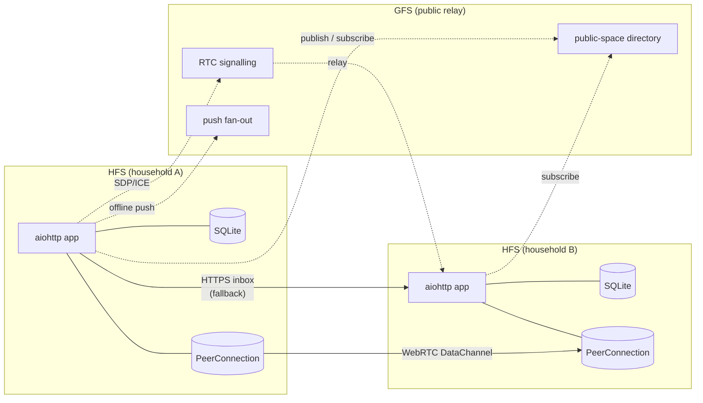
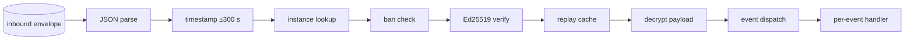

# Architecture

How Social Home fits together. Distilled from §4 of `spec_work.md`
plus the current code under `socialhome/`.

For the wire-level federation protocol — envelopes, validation
pipeline, per-feature flows — see [`protocol/README.md`](./protocol/README.md).
This page covers the **system shape** behind that protocol: who runs
what, how identity works, how peers stay in sync, how spaces stay
encrypted across membership churn, and how the system recovers when
peers go offline.

## Topology

Each household runs one **Household Federation Server (HFS)**.
Households talk to each other directly, peer-to-peer. A central
**Global Federation Server (GFS)** is consulted only for tasks that
genuinely need a meeting point: public-space discovery, push fan-out
to offline peers, and WebRTC signalling bootstrap. The GFS sees
routing metadata only — never plaintext content.

A single HFS can run in three platform modes, selected by `SH_MODE`:

| Mode | Adapter | When |
|---|---|---|
| `standalone` | `StandaloneAdapter` | Direct deploy: local users, password auth, no Home Assistant. |
| `ha` | `HaAdapter` | HA Core + REST: SH talks to a Home Assistant install via REST, but is *not* itself an add-on. |
| `haos` | `HaosAdapter` | HA Supervisor add-on: runs inside HAOS with Ingress auth and Supervisor APIs. |

Mode-specific code lives in `socialhome/platform/{standalone,ha,haos}/`.
Route handlers and services consume the adapter through Provider
Protocols (`AuthProvider`, `UserDirectory`, `PushProvider`, …) plus
a `capabilities` set, never by branching on `config.mode`. See
`socialhome/platform/adapter.py`.

## Identity (§4.1)

Every identity in Social Home — instance and user — is bound to an
Ed25519 public key. Identifiers are deterministic 32-character base32
strings derived from a SHA-256 of that key, so any party can verify a
claimed `instance_id` or `user_id` by recomputing the digest. No
central registry is involved.

- **`instance_id`** — derived from the HFS's long-term Ed25519 public
  key (`derive_instance_id(public_key_bytes)`). Generated once on first
  startup and never reassigned. Stored in `instance_identity`.
- **`user_id`** — derived from the **home instance's** public key
  plus the user's local username, with a null-byte separator
  (`derive_user_id(instance_pk, username)`). Globally unique,
  cryptographically bound to the home instance, and survives across
  spaces and DMs.
- **`UserIdentityAssertion`** — when an instance refers to one of
  its users in a federation event (`USERS_SYNC`, embedded in space
  events, etc.), it ships a signed assertion binding the `user_id`
  to the username + display name. Receivers verify the signature
  with the home instance's public key on every inbound event.

### Post-quantum migration (§25.8)

Identity is **classical Ed25519 by default**, with optional **ML-DSA-65
hybrid signatures** wired in. When `federation_sig_suite =
'ed25519+mldsa65'` is set, every signed payload carries both an
Ed25519 and an ML-DSA-65 signature; receivers verify both. The
fallback to classical happens automatically per-peer based on what
each side advertised at pairing — see `remote_instances.sig_suite`.

The PQ key material lives alongside the classical key in
`instance_identity` (columns `pq_algorithm`, `pq_private_key`,
`pq_public_key`); peer PQ keys live in `remote_instances.remote_pq_*`.
Key generation is done by `socialhome/federation/pq_signer.py` and
the bootstrap is in `infrastructure/key_manager.py`.

### Implementation pointers

- `socialhome/federation/crypto_suite.py` — derive_instance_id /
  derive_user_id, signature verification, hybrid suite selection.
- `socialhome/infrastructure/key_manager.py` — first-startup keypair
  generation, KEK encryption of private key material at rest.
- `socialhome/repositories/federation_repo.py` — `instance_identity`
  + `remote_instances` reads/writes.
- See [`protocol/pairing.md`](./protocol/pairing.md) for the
  pairing handshake that bootstraps trust between two instances.

## Progressive sync (§4.2)

Federation traffic is split across three transports based on what the
event needs and whether the peer is reachable:

| Tier | Transport | Used for |
|---|---|---|
| 1 — hot | WebRTC DataChannel `fed-v1` | Routine, real-time envelopes once the P2P channel is up. |
| 2 — warm | WebRTC DataChannel `sync-v1` | Bulk content sync (initial sync after pairing, recovery after long offline). |
| 3 — cold | HTTPS inbox `POST /federation/inbox/{id}` | Fallback before/while DataChannel is down, and for peers behind a blocked UDP path. |

Both tiers run their inbound traffic through the same §24.11
validation pipeline (parse → timestamp → instance lookup → ban check
→ Ed25519 verify → replay cache → decrypt → dispatch). Whether an
envelope arrives over RTC or HTTPS is invisible to the per-event
handlers; both paths land in
`federation/inbound_validator.InboundPipeline`.

### Outbox and retries

Outbound envelopes go to `federation_outbox` first
(`socialhome/repositories/outbox_repo.py`). The
`infrastructure/outbox_processor.py` scheduler walks the table on a
fixed cadence, picks the best transport for each peer (RTC if open,
HTTPS otherwise), and retries with exponential backoff. Structural /
security-critical events have `expires_at = NULL` and never age out;
ordinary events have a 7-day TTL (§4.4.7).

### Bulk sync

Initial content sync after pairing (and recovery sync after a long
outage) runs over the dedicated `sync-v1` DataChannel label so the
chunky Tier-2 traffic doesn't head-of-line block routine Tier-1
envelopes. The orchestration lives in
`socialhome/federation/sync_manager.py` and the per-feature
chunkers under `socialhome/federation/sync/space/` and
`socialhome/federation/sync/dm_history/`. Wire details are in
[`protocol/sync.md`](./protocol/sync.md).

## Space cryptographic identity (§4.3)

Every space has its own Ed25519 keypair and a per-epoch AES-256
content key. Members who can read the space hold the current epoch's
content key; members who left or were banned cannot — because the
**epoch advances** on member removal, and the new key is delivered
only to remaining members.

- `spaces.identity_public_key` — the space's permanent Ed25519
  public key, derived once at creation.
- `space_keys(space_id, epoch)` — one row per epoch holding the
  KEK-encrypted AES-256 content key.
- Membership change → rekey: when a member is removed or banned,
  `space_crypto_service.py` derives a new content key, increments
  `epoch`, and ships a `SPACE_KEY_ROTATED` event encrypted to each
  remaining member's identity key.

Detailed flow with diagrams is in
[`protocol/spaces.md`](./protocol/spaces.md). The space-level
`config_sequence` column on `spaces` provides last-writer-wins
ordering for non-key config changes.

### Implementation pointers

- `socialhome/services/space_crypto_service.py` — key derivation,
  rekey orchestration.
- `socialhome/repositories/space_key_repo.py` — `space_keys` reads
  and writes.
- `socialhome/services/space_service.py` — membership churn that
  triggers rekey.

## Resilience and outage recovery (§4.4)

Federation is asynchronous: peers go offline, networks partition,
addons get restarted. The system is designed so that none of this
loses data, and every event is processed at most once.

### Replay cache

Every accepted envelope's `msg_id` lands in `federation_replay_cache`
with a received-at timestamp. Inbound validation rejects any envelope
whose `msg_id` is already cached (idempotency at the federation
boundary). The
`infrastructure/replay_cache_scheduler.py` evicts entries older than
the §24.11 horizon on a slow cadence so the table doesn't grow
unboundedly.

### Idempotency keys

Mutating HTTP routes accept an `Idempotency-Key` header; the
`infrastructure/idempotency.py` middleware deduplicates by
`(user_id, key)`. Combined with the replay cache, this means
both API callers and federation peers can retry safely.

### Reconnect queue

When a peer flips from `unreachable` → `confirmed`, the
`infrastructure/reconnect_queue.py` flushes any envelopes that
piled up in `federation_outbox` for that peer in dependency order.
This is what makes "long offline → come back online" recover
without operator intervention.

### Schedulers (the `_stop: asyncio.Event` pattern)

Every background loop in `socialhome/infrastructure/` follows the
same lifecycle: `_stop: asyncio.Event` set in `stop()`, drained in
`start()`, body is `while not self._stop.is_set()`. Reference
template: `replay_cache_scheduler.py`. Schedulers cover replay-cache
eviction, outbox processing, calendar reminders, page-lock expiry,
post-draft GC, pairing-relay flush, post-rotation tasks, space
retention, task deadlines, and recurring-task spawning.

### Page conflict resolution

Concurrent edits to a space page produce a `space_page_snapshots`
row with `conflict=1`. The space's editing UI offers
`mine | theirs | merged_content` resolution before further edits are
allowed. Lives in `socialhome/services/page_conflict_service.py`.

### Implementation pointers

- `socialhome/infrastructure/replay_cache_scheduler.py` (template).
- `socialhome/infrastructure/outbox_processor.py`.
- `socialhome/infrastructure/idempotency.py`.
- `socialhome/infrastructure/reconnect_queue.py`.
- `socialhome/services/page_conflict_service.py`.

## Where things live

| Concern | Path |
|---|---|
| Domain types (frozen dataclasses) | `socialhome/domain/` |
| Repositories (the only place SQL lives) | `socialhome/repositories/` |
| Services (business logic) | `socialhome/services/` |
| Federation (envelope, signing, transport, sync) | `socialhome/federation/` |
| Routes (`BaseView` subclasses) | `socialhome/routes/` |
| Background schedulers | `socialhome/infrastructure/` |
| Platform adapters (HA / HAOS / standalone) | `socialhome/platform/` |
| DB layer + Unit of Work | `socialhome/db/` |
| Schema | `socialhome/migrations/0001_initial.sql` |

The repository layer never imports from services; services depend on
`Abstract*Repo` Protocols, never on `Sqlite*Repo` concretes. `BaseView`
maps domain exceptions to HTTP responses centrally
(`socialhome/routes/base.py`). See `CLAUDE.md` for the full set of
architectural rules.

## Spec references

- §2 — design principles (mirrored in [`principles.md`](./principles.md))
- §4 — architecture overview (this page)
- §4.1 — identity system
- §4.2 — progressive sync and DataChannel
- §4.3 — space cryptographic identity
- §4.4 — resilience and outage recovery
- §11 — instance pairing
- §13 — spaces
- §24.11 — inbound validation pipeline
- §25.8 — post-quantum signature migration
