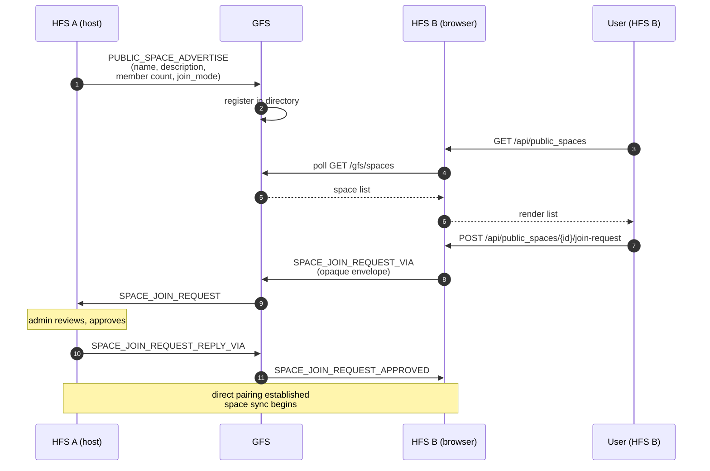

# Public-Space Discovery

How a user on one household finds a public space hosted on a
household they've never heard of. GFS is the directory; it holds
metadata, not content.

## Scope

- **HFS**: publishes a space it wants to make public; subscribes to
  the GFS directory to browse others; relays join requests through
  GFS to hosts it's not yet paired with.
- **GFS**: maintains the global registry of published spaces,
  serves `GET /gfs/spaces`, and forwards opaque `_VIA` envelopes
  between unpaired instances.

## Event types

`PUBLIC_SPACE_ADVERTISE`, `PUBLIC_SPACE_WITHDRAWN`,
`SPACE_DIRECTORY_SYNC` (peer-to-peer snapshot, distinct from GFS).

Join-request events belong to the [invites](./invites.md) flow but
ride on the same `_VIA` relay pattern.

## Transport (SH ↔ GFS)

The Social Home ↔ GFS link is split by direction:

- **SH → GFS** is plain HTTPS REST under `/gfs/*` (`register`,
  `publish`, `subscribe`, `report`, `appeal`, `spaces`). Synchronous
  request / response with explicit status codes; no shared session
  state. **Every mutating call is Ed25519-signed by the originating
  instance and verified against its registered public key** — there is
  no unsigned path:
  - `publish` (relay event) and `spaces/{id}/publish` (space metadata)
    require a mandatory household signature over their canonical body; an
    empty / malformed / invalid signature is rejected with `403`, so a
    registered peer can never overwrite another household's listing or fan
    out under its name.
  - `spaces/{id}/publish` additionally carries the space's Ed25519
    **authority** verify key (`identity_public_key`, hex). The GFS
    **TOFU-pins** it on the first publish and holds it immutable — a later
    publish offering a different key keeps the pinned one.
  - `publish` (relay) is authorized by **either** the owner path
    (`from_instance` == the space's owning instance) **or** a valid
    **space-authority signature** carried in `payload` (`authority_sig` +
    `authority_sig_suite`, event type `space_post_public`) verified against
    the pinned `identity_public_key`. Because any seed-holder — the owner or
    a delegated admin — can produce that signature, a space keeps relaying
    while its owner is offline (the owner-offline-spaces epic). The GFS stays
    blind to space content: it verifies the signature over the opaque
    `payload` and fans out, never decrypting. Fail-closed — a
    present-but-invalid authority sig, an unknown suite, a non-owner relaying
    a space with no pinned pubkey, **or a non-owner whose wire `event_type`
    isn't `space_post_public`** (the only type the authority sig authorizes)
    are each rejected with `403`. The owner path is exempt and may relay any
    `event_type`.
  - **Replay / dedupe contract.** The authority signature binds the space id
    and the (opaque) `payload`, but **no timestamp, nonce, or epoch**, and the
    GFS keeps **no replay cache**, so `publish` relay is idempotent /
    at-least-once: a captured authority-signed payload can be re-POSTed and
    re-fanned-out (a property the owner relay already had under #598, widened
    by the non-owner authority path). The GFS deliberately adds **no** replay
    machinery — it is content-blind and can't read the post id inside the
    encrypted payload. The content-layer backstop is **subscriber-side dedupe
    by the post id** carried inside the payload, enforced by the HFS
    `space_public_inbound` consumer (the same way moments dedupe by
    `moment_id`).
  - `subscribe` requires a signature over `{instance_id, space_id, ts}`
    (replay-guarded ±300 s on `ts`). The signature binds the request to
    `instance_id`, so a caller can only subscribe **itself**, and the
    target space must already be published — the GFS no longer mints a
    pending row from an (unauthenticated) subscribe.
- **GFS → SH** is a persistent WebSocket the SH opens to
  `wss://<gfs>/gfs/ws`. The first frame is a signed hello
  `{type:"hello", instance_id, ts, sig}`; once accepted the GFS pushes
  `{type:"relay", space_id, event_type, payload, from_instance}`
  frames as fan-out happens. When no WebSocket is open the GFS falls
  back to an HTTPS POST callback to the instance's registered
  `inbox_url`.

WebRTC is **not** used for the SH↔GFS leg — the GFS is publicly
reachable, so NAT traversal buys nothing while DTLS plus per-connection
PeerConnection state would be much more resource-hungry than a plain
WebSocket. WebRTC stays for §4.2.3 SH↔SH direct sync and §26 calls
(both genuinely peer-to-peer). See spec §24.12 for the full transport
specification.

## Flow — publish + browse + join

## Peer directory sync (§D1a)

In parallel with the GFS directory, paired peers exchange their own
lists of public spaces via `SPACE_DIRECTORY_SYNC`. This builds a
decentralised directory — a user browsing on HFS B sees both spaces
their GFS knows about and spaces their directly-paired peers know
about. The peer directory is authoritative for the households that
publish it; GFS is authoritative only for the spaces that explicitly
advertised to that specific GFS.

## Withdrawal

`PUBLIC_SPACE_WITHDRAWN` removes a space from the GFS directory and
from peer directories on the next `SPACE_DIRECTORY_SYNC`. Members
already in the space keep their membership — withdrawal only affects
discoverability, not existing peering.

## Blocking

A local admin can block a specific GFS instance:
`POST /api/public_spaces/blocked_instances/{instance_id}`. Blocked
GFS instances are not polled; any space listed only there becomes
invisible. Useful for refusing a GFS whose moderation policy you
disagree with.

## Moderation path

GFS operators can accept / reject / ban both spaces (bad listings)
and instances (bad actors) via the admin portal
(`/admin/api/spaces`, `/admin/api/clients`). Banned spaces stop
federating advertisements; banned instances are dropped from the
relay. `POST /api/gfs/connections/{gfs_id}/appeal` lets an HFS admin
contest a ban.

## Implementation

- `socialhome/services/public_space_service.py` — client side.
- `socialhome/global_server/public.py`,
  `socialhome/global_server/federation.py` — GFS directory.
- `socialhome/federation/peer_directory_handler.py` — peer
  directory sync on HFS.
- `socialhome/global_server/routes/public.py`,
  `socialhome/global_server/routes/admin/*.py` — GFS REST +
  admin API.

## Spec references

§24 (GFS protocol),
§D1a (peer directory sync),
§24.6 (moderation & appeals).
