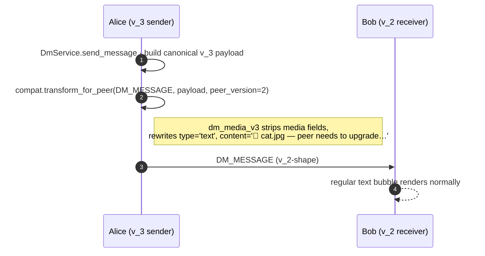

# DM media — pictures, videos, files

## Summary

`MESSAGE_TYPES` carries the canonical scope of a Social Home DM:

```
text · image · video · file · transcript · location
```

The first three of those — **image**, **video**, and **file** — share
one wire shape (a `media_url` plus the new `file_name` / `mime_type`
/ `file_size_bytes` metadata triple) and a two-tier delivery path
that lets cross-household attachments render *immediately* via a
small preview embedded in the encrypted envelope while the full
bytes follow on a separate
[`DM_MEDIA_BLOB`](../../socialhome/domain/federation.py) event.

## Scope

- **Federated-only.** Media attachments are allowed when the
  conversation's remote participants are all reachable through a
  *direct confirmed pairing* with the sender's household. A DM whose
  path requires the multi-hop `DM_RELAY` route (the bazaar-style
  "contact a seller through a mutual friend" flow) **rejects** media
  with `HTTP 422 MEDIA_REQUIRES_DIRECT_PAIRING`. Operator decision:
  relays are explicitly the lower-trust path and shouldn't shuttle
  picture / video / file bytes through third-party households.
- **Bytes ride encrypted.** Both the preview embedded in
  `DM_MESSAGE` and the full bytes ridden by `DM_MEDIA_BLOB` sit
  inside the §25.8.21 encryption envelope. Routing fields stay
  plaintext; everything else (filename, MIME, sizes, preview pixels)
  is encrypted under the conversation key.
- **Same processing as feed media.** Uploads ride through
  `POST /api/media/upload` (the existing endpoint posts use). Size
  caps + transcoding (`ImageProcessor`, `VideoProcessor`) come from
  [`socialhome/domain/media_constraints.py`](../../socialhome/domain/media_constraints.py).
  Image ≤ 20 MiB, longest side 2560 px → WebP @ Q82. Video ≤ 200 MiB,
  1080p, 60 sec max, CRF 25 → WebM. Files (`type='file'`) pass
  through bytes unchanged.

## Event types

| Event | When | Carries |
|---|---|---|
| `DM_MESSAGE` (v_3-shape) | Always — same envelope as a text DM | `type` ∈ {`image`, `video`, `file`}, `media_url` (local-signed for same-household, embedded preview ref for cross-household), `file_name`, `mime_type`, `file_size_bytes`, `media_blob_id` |
| `DM_MEDIA_BLOB` *(reserved, lands in follow-up)* | Cross-household only, fired by sender's outbox after a successful `DM_MESSAGE` | `media_blob_id` (matches the `DM_MESSAGE` it follows), `message_id`, `conversation_id`, encrypted full-bytes payload |

## Flow

### Same-household DM with an attachment

```mermaid
sequenceDiagram
  autonumber
  participant Alice as Alice (SPA)
  participant Backend as SocialHome backend
  participant Bob as Bob (SPA)

  Alice->>Backend: POST /api/media/upload (multipart)
  Backend->>Backend: ImageProcessor / VideoProcessor
  Backend-->>Alice: { url, signed_url, filename }
  Alice->>Backend: POST /api/conversations/{id}/messages<br/>{ type, media_url, file_name, … }
  Backend->>Backend: DmService.send_message · save row · publish DmMessageCreated
  Backend-->>Bob: WS frame dm.message (with media_url signed for Bob)
  Bob-->>Bob: bubble renders &lt;img&gt; / &lt;video&gt; / file pill inline
```

### Cross-household DM with an attachment — preview-now, sync-later *(scheduler lands in follow-up PR)*

```mermaid
sequenceDiagram
  autonumber
  participant Alice as Alice (sender's HFS)
  participant Bob as Bob (receiver's HFS)

  Note over Alice: SPA upload via /api/media/upload<br/>then POST to /messages

  Alice->>Alice: Build small preview (240 px WebP for image/video, glyph for file)
  Alice->>Bob: DM_MESSAGE (v_3, encrypted)<br/>{ media_blob_id, file_name, mime_type, preview_bytes_b64 }
  Bob-->>Bob: Save preview to local cache;<br/>bubble renders immediately with media_sync_status='pending'
  Note over Alice,Bob: ─── background ───
  Alice->>Bob: DM_MEDIA_BLOB (encrypted, may be chunked)
  Bob-->>Bob: Decrypt + store full bytes;<br/>update conversation_messages.media_url +<br/>media_sync_status=NULL
  Bob-->>Bob: WS push dm.media_ready → SPA<br/>swaps preview src for full media
```

### Sub-v_3 peer (§319 ¶5 `fallback`)



## Server-side validation

- `DmService.send_message` rejects media on a relay-only conversation
  via `MediaRequiresDirectPairingError` → HTTP 422 with code
  `MEDIA_REQUIRES_DIRECT_PAIRING`. The SPA surfaces a clear copy
  ("only paired households can receive media") and keeps the
  staged attachment around so the user can drop it and resend as
  text.
- Size + MIME caps are enforced inside `MediaUploadView` before
  `media_url` ever reaches the DM POST. The DM route trusts the
  uploaded blob's signed URL.
- The receiver's `_on_dm_message` upserts on
  `conversation_messages.id` so a v_3 message arriving twice (the
  envelope + a redelivery) produces a single row.

## SPA render

[`DmThreadPage.tsx`](../../client/src/features/dms/DmThreadPage.tsx)
renders three message-bubble shapes based on `mime_type` (or the
explicit `type` when `mime_type` is `null`):

- `image/*` → ``
- `video/*` → `<video class="sh-message-media sh-message-media--video" controls preload="metadata">`
- everything else → file pill (`a.sh-message-file`) with a `📎`
  glyph + filename + size, the anchor's `href` is the signed media
  URL with `download={file_name}` so the user gets a real save
  prompt.

When `media_sync_status === 'pending'`, the media gets a `--pending`
modifier class that adds a subtle brightness pulse — the visual cue
for the cross-household "preview now, full bytes coming" state.
Once the matching `DM_MEDIA_BLOB` lands, the backend's
`dm.media_ready` WS frame swaps `media_url` to the local full-bytes
URL and the modifier is removed.

## Implementation pointers

- `socialhome/domain/conversation.py` — `MESSAGE_TYPES`, the
  `ConversationMessage` dataclass with the new media columns.
- `socialhome/migrations/0003_dm_media.sql` — schema delta + the
  `dm_media_outbox` table for the cross-household scheduler.
- `socialhome/services/dm_service.py` — `send_message` accepts the
  new fields; `_reject_media_on_relay_only_conversation` enforces
  the federated-only gate; `_fan_to_remote` runs every outbound
  through `compat.transform_for_peer`.
- `socialhome/federation/compat/` — version-aware payload
  transforms. New compat tree introduced in this feature; see the
  package docstring + `dm_media_v3.py` for the canonical shape.
- `socialhome/domain/federation.py` — `DM_MEDIA_BLOB` enum entry
  (reserved here, full pipeline lands in a follow-up PR).
- `client/src/features/dms/DmThreadPage.tsx` — paperclip attach
  button, pre-send preview tile, bubble renderers.
- `client/src/components/UploadProgress.tsx` — shared
  `uploadWithProgress` used by both feed posts and DM attachments.

## Spec refs

- §5.2 — DM scope and `MESSAGE_TYPES` definition.
- §25.8.21 — encryption-first rule: every field that isn't a routing
  primitive sits inside the encrypted payload, including the
  preview bytes and `DM_MEDIA_BLOB`'s full bytes.
- [Issue #319](https://github.com/social-home-io/socialhome/issues/319),
  paragraph 5 — per-feature degraded-shape policy. DM media: `fallback`.
