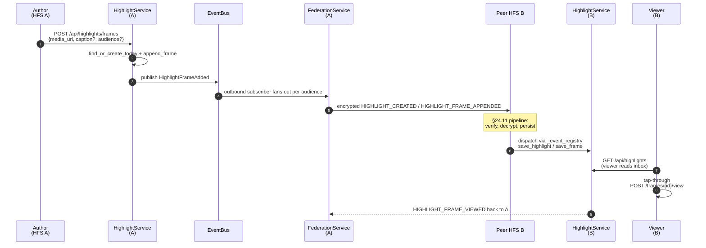

# Highlights

Personal "highlights" pillar — a WhatsApp/Instagram-style tap-through
sequence of images and short videos, posted to the author's confirmed
peer instances based on an author-controlled audience.

## Scope

- **HFS**: full participant. Authors post frames, peers receive them
  through the §24.11 inbound pipeline.
- **GFS**: uninvolved. Highlights are personal-scope, not space-scope.

## Event types

`HIGHLIGHT_CREATED`, `HIGHLIGHT_FRAME_APPENDED`, `HIGHLIGHT_FRAME_DELETED`,
`HIGHLIGHT_DELETED`, `HIGHLIGHT_FRAME_VIEWED`, `HIGHLIGHT_FRAME_REACTED`,
`HIGHLIGHT_FRAME_REACTION_REMOVED`.

Plaintext fields on every envelope: `event_type`, `from_instance`,
`to_instance`, `highlight_id`, and (where applicable) `frame_id`. Everything
else — `frame_type`, `sequence`, `media_url`, `caption_text`,
`caption_emoji`, `audience_user_ids` (only for `audience_kind=users`),
`expires_at`, viewer / reactor user ids — rides inside the encrypted
payload (§25.8.21).

## Audience kinds

| Kind         | Plaintext addressing                       | Encrypted allow-list |
|--------------|--------------------------------------------|----------------------|
| `all_paired` | one envelope per `confirmed` peer instance | none                 |
| `households` | one envelope per author-picked peer        | none                 |
| `users`      | one envelope per peer hosting any listed   | per-user user-id list — receivers gate before surfacing |

## Day model

`UNIQUE(author_user_id, highlight_date)` on the `highlights` table enforces
"one highlight per author per day". The first frame of the day creates the
row + emits `HIGHLIGHT_CREATED`; subsequent frames append + emit
`HIGHLIGHT_FRAME_APPENDED`. New day → new highlight row. The receiving instance
upserts the highlight by id, then appends the frame.

## Retention

The author's `preferences_json.highlights.retention_days` and `.max_count`
configure the local retention policy. The `HighlightRetentionScheduler`
runs hourly:

1. Drop rows where `expires_at < now()`.
2. Per author, drop the oldest highlights beyond `max_count`.

`feed_posts.linked_highlight_id` (and the space variant) are `ON DELETE SET
NULL`, so a `highlight_share` post survives the underlying highlight's
retention — the share-card renders a "Highlight has ended" placeholder.

## Mermaid sequence — author posts a frame

## Implementation pointers

- Schema: `socialhome/migrations/0001_initial.sql` — `highlights`,
  `highlight_frames`, `highlight_frame_views`, `highlight_frame_reactions`.
  ``highlights.author_user_id`` is plain text (no FK to ``users``) so
  remote-author rows from the inbound pipeline land alongside local
  rows; same convention as ``conversation_messages.sender_user_id``.
- Domain: `socialhome/domain/highlight.py`.
- Repo: `socialhome/repositories/highlight_repo.py` —
  ``list_visible_to`` filters by audience and personal block list,
  ``save_highlight`` / ``save_frame`` are upsert helpers used by the
  inbound handlers.
- Service: `socialhome/services/highlight_service.py`. `expire_due()`
  drives the scheduler. Local writes publish ``HighlightFrameAdded`` /
  ``HighlightFrameRemoved`` / ``HighlightRemoved`` on the bus.
- Outbound federation:
  ``socialhome/services/highlight_federation_outbound.py``. Subscribes to
  the three Highlight domain events; gates each on "is the author local
  on *this* instance?" (``user_repo.get_instance_for_user(author) ==
  own``) so the same events republished from the inbound path don't
  echo back to peers. Audience routing:
  - ``all_paired`` → ``federation_repo.list_instances(status='paired')``
  - ``households`` → use the listed instance ids verbatim
  - ``users``      → resolve each user_id to its home instance via
    ``user_repo.get_instance_for_user``.
- Inbound federation: handler block in
  ``socialhome/services/federation_inbound_service.py`` registered
  by ``attach_to`` for all seven ``HIGHLIGHT_*`` event types
  (``HIGHLIGHT_CREATED`` / ``HIGHLIGHT_FRAME_APPENDED`` /
  ``HIGHLIGHT_FRAME_DELETED`` / ``HIGHLIGHT_DELETED`` are author → audience;
  ``HIGHLIGHT_FRAME_VIEWED`` / ``HIGHLIGHT_FRAME_REACTED`` /
  ``HIGHLIGHT_FRAME_REACTION_REMOVED`` are viewer → author back-channel).
  Each persists via ``highlight_repo`` and republishes the matching
  domain event so :class:`RealtimeService` fans the WS frame to the
  right local audience. The back-channel handlers verify the
  envelope's signed sender is the *viewer's* / *reactor's* home
  instance — peers can't fabricate views or reactions on behalf of
  someone else.
- Realtime push: ``socialhome/services/realtime_service.py`` —
  subscribes to the five Highlight bus events. Author-side events
  (``HighlightFrameAdded`` / ``HighlightFrameRemoved`` / ``HighlightRemoved``)
  fan ``highlight.frame_added`` / ``highlight.frame_removed`` /
  ``highlight.removed`` WS frames to the whole household so the SPA
  refetches ``/api/highlights`` (audience-filtered server-side).
  Back-channel events (``HighlightFrameViewed`` /
  ``HighlightFrameReactionChanged``) fan ``highlight.frame_viewed`` /
  ``highlight.frame_reaction_changed`` only to the *author's* WS
  sessions — unrelated household members don't need the noise.
- Routes: `socialhome/routes/highlights.py`.
- Retention scheduler:
  `socialhome/infrastructure/highlight_retention_scheduler.py` (copies the
  `_stop: asyncio.Event` template from `replay_cache_scheduler.py`).
- Frontend: `client/src/features/highlights/` (4 pages — inbox, viewer,
  composer, archive), `client/src/components/HighlightShareCard.tsx`, and
  `client/src/components/HighlightPickerDialog.tsx` for sharing into a feed.

## Spec refs

- §24.11 inbound validation pipeline (encryption-first applies).
- §25.8.21 every field encrypted unless required for routing.
- §Highlights (this page) for the author retention + audience model.
