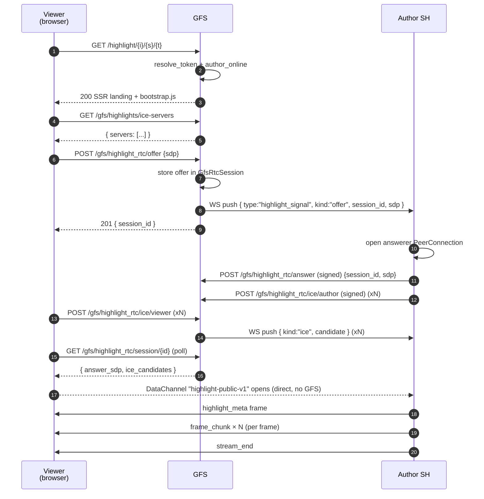

# Highlights — public sharing via GFS

A highlight author can opt a single highlight into public sharing through a
paired Global Federation Server (GFS). The GFS mints a revocable URL
the author can paste into Twitter / email / SMS; anyone visiting the
URL gets a public landing page. The page bootstraps a WebRTC
DataChannel **directly to the author's instance** — highlight bytes never
transit GFS. GFS only relays SDP/ICE during the handshake.

This is the only path in Social Home where a non-Social-Home browser
can view a highlight. The author's existing audience and retention rules
still apply: a publication can never outlive `highlights.expires_at`, and
revoking a token (or unpublishing) takes effect on the next request.

## Scope

- **HFS** runs :class:`HighlightPublicationService` (publish / revoke /
  unpublish) and (PR2) :class:`HighlightSignalingHandler` for the WebRTC
  answerer side.
- **GFS** runs :class:`HighlightPublicationRegistry` and serves the
  ``/highlight/{instance}/{highlight}/{token}`` public landing page. PR2 adds
  the public ``/gfs/highlight_rtc/*`` signalling endpoints.

## URL shape

```
https://{gfs_host}/highlight/{instance_id}/{highlight_id}/{token}
```

* ``instance_id`` — author's HFS instance id.
* ``highlight_id`` — opaque highlight id on that instance.
* ``token`` — 32-byte urlsafe-base64. Revocable, multiple per
  publication. Authoritative; the GFS resolves it against
  ``gfs_highlight_tokens`` and rejects mismatched ``(instance_id, highlight_id)``
  tuples in the URL.

## OG card (optional)

Authors can opt a published highlight into a social-card preview image
so links pasted into Twitter / iMessage / Slack render with a real
thumbnail rather than a generic OG card. The thumbnail is cached on
the GFS as a JPEG (≤200 KB) and served at a stable URL so social-
card crawlers can fetch it without the share token:

```
https://{gfs_host}/highlight/{instance_id}/{highlight_id}/og.jpg
```

Author SH uploads via `POST /api/highlights/{id}/publish/og` with a
``{image_b64}`` body; the SH service forwards a signed envelope to
the GFS at `POST /gfs/highlights/{highlight_id}/og`. Re-uploads overwrite
in place (deterministic filename `{instance_id}_{highlight_id}.jpg`),
and unpublishing wipes the cached file. The highlight bytes still stream
author → viewer over WebRTC — only the thumbnail lives on GFS, only
because OG crawlers can't pass query parameters when fetching the
image.

## Wire endpoints

Author SH → GFS (Ed25519-signed body, same `_rtc_authenticate`
middleware as `/gfs/rtc/*`):

| Method | Path | Purpose |
|---|---|---|
| POST | `/gfs/highlights/{highlight_id}/publish` | Record a publication and mint the first share token. Body: `{highlight_id, instance_id, expires_at, label?, signature}`. Returns `201 {token, url, label}`. |
| POST | `/gfs/highlights/{highlight_id}/tokens` | Mint another token under an existing publication. Body: `{label?, signature}`. Returns `201 {token, url, label}`. |
| POST | `/gfs/highlight_tokens/{token}/revoke` | Revoke a single token. Body must come from the publishing instance — guards against cross-instance revoke. |
| POST | `/gfs/highlights/{highlight_id}/unpublish` | Drop the publication; CASCADE revokes every token under it. |

Public (no signature):

| Method | Path | Purpose |
|---|---|---|
| GET | `/highlight/{instance_id}/{highlight_id}/{token}` | SSR landing page. `200` (token active + author online), `410 Gone` (token revoked / publication missing / highlight expired / URL mismatch), `503 Unavailable` (author offline). |

Public-viewer WebRTC signalling (added in PR2):

| Method | Path | Purpose |
|---|---|---|
| GET | `/gfs/highlights/ice-servers` | Anonymous list of STUN/TURN URLs the browser bootstrap feeds into `RTCPeerConnection`. |
| POST | `/gfs/highlight_rtc/offer` | Anonymous. Body: `{instance_id, highlight_id, token, sdp}`. GFS verifies the token, stores the offer in :class:`GfsRtcSession`, and pushes a `highlight_signal` WS frame to the author's instance. Returns `{session_id}`. |
| GET | `/gfs/highlight_rtc/session/{session_id}` | Anonymous. Browser polls until `answer_sdp` and any author-side ICE candidates land. |
| POST | `/gfs/highlight_rtc/ice/viewer` | Anonymous. Body: `{session_id, candidate}`. Forwards to the author's WS as a `highlight_signal kind=ice` frame. |
| POST | `/gfs/highlight_rtc/answer` | Author SH only (Ed25519-signed). Body: `{instance_id, session_id, sdp, signature}`. Authority guard: `session.initiator_id` must match the signing instance. |
| POST | `/gfs/highlight_rtc/ice/author` | Author SH only (signed). Same authority guard; appends to `ice_candidates` so the next viewer poll sees it. |

The viewer DataChannel has label `highlight-public-v1` and uses the
length-prefixed JSON-header / binary-payload framing detailed below.

## Retention

* Per-publication: `gfs_highlight_publications.expires_at` is a unix
  epoch mirroring the author's `highlights.expires_at`. The GFS cron
  call `prune_expired(now)` drops past-cap rows; `lookup_active`
  filters live too.
* Per-token: `revoked_at` is `NULL` while active; setting it to a
  unix epoch makes `resolve_token` return `None` immediately.
* Author can revoke any individual token without affecting other
  tokens under the same publication.
* No follower / viewer extension — the same retention rule that
  governs the in-mesh viewer governs the public viewer.

## Author-online check

A publication is only servable while the author's instance has a
live SH↔GFS WebSocket. The landing-page handler queries
`GfsWebSocketRegistry.is_connected(instance_id)`; offline author →
503 with a 10-second auto-refresh meta tag. PR2 needs the live WS
anyway because it pushes the public viewer's WebRTC offer over it.

## DataChannel framing

Single ordered DataChannel labelled `highlight-public-v1`. Every frame on
the wire is:

```
[u32 header_len BE][header_json][u32 payload_len BE][payload_bytes]
```

`header_json` is UTF-8 JSON with a `kind` field. Reserved kinds (v1):

| `kind` | Direction | Header fields | Payload |
|---|---|---|---|
| `highlight_meta` | author → viewer (first frame) | `highlight` (full Highlight dict), `frames` (manifest: `[{frame_id, sequence, content_type, byte_length, caption_text, caption_emoji, duration_ms}, …]`) | empty |
| `frame_chunk` | author → viewer | `frame_id`, `sequence`, `chunk_index`, `is_last_chunk`, `byte_length` | up to `CHUNK_SIZE` (64 KiB) bytes |
| `stream_end` | author → viewer (terminator) | `kind` only | empty |
| `error` | author → viewer | `error` (one of `expired`, `unauthorized`, `backpressure`) | empty |

Backpressure: author waits on `RTCDataChannel.bufferedAmount <
SEND_HWM_BYTES` (1 MiB) before pushing the next chunk. Reference
encoder + decoder: `socialhome/services/highlight_public_framing.py`;
golden-bytes test in `tests/protocol/test_highlight_public_framing.py`
(release-blocker per CLAUDE.md §27.9).

## Sequence (public viewer flow)



## Public viewer bundle

The viewer that the GFS landing serves is a Preact component built
from `client/gfs/public_highlight.tsx` via a separate Vite config
(`client/vite.gfs.config.ts`) that emits a single self-contained
IIFE bundle to `socialhome/global_server/static/highlight_public_viewer.js`.
Sharing the SPA's Preact + Vite tooling gives us one component model
across both surfaces; future GFS UI work (admin portal port, public
global-space pages) plugs in as additional rollup inputs without a
second toolchain. Run `pnpm build:gfs` from `client/` to rebuild the
GFS bundle alone, or `pnpm build` for both.

## Implementation pointers

- Schema (SH side): `socialhome/migrations/0001_initial.sql` —
  `highlights.public_gfs_id`, `highlights.public_published_at`.
- Schema (GFS side): `socialhome/global_server/migrations/0001_initial.sql`
  — `gfs_highlight_publications`, `gfs_highlight_tokens`.
- Domain: `socialhome/domain/highlight.py` (`Highlight.public_*` fields);
  `socialhome/global_server/domain.py` (`GfsHighlightPublication`,
  `GfsHighlightToken`).
- Repos: `socialhome/repositories/highlight_repo.py`
  (`mark_published` / `mark_unpublished` / `list_published_for`);
  `socialhome/global_server/repositories.py`
  (`SqliteGfsHighlightPublicationRepo`, `SqliteGfsHighlightTokenRepo`).
- Services: `socialhome/services/highlight_publication_service.py` (SH);
  `socialhome/global_server/highlight_publications.py` (GFS registry).
- Routes: `socialhome/routes/highlight_publications.py` (SH);
  `socialhome/global_server/routes/highlights.py` (GFS);
  `socialhome/global_server/routes/highlight_rtc.py` (public + author RTC).
- Author-side answerer: `socialhome/services/highlight_signaling_handler.py`.
- Framing: `socialhome/services/highlight_public_framing.py` +
  `tests/protocol/test_highlight_public_framing.py` (golden-bytes test).
- Public viewer: `client/gfs/public_highlight.tsx` + the matching Vite
  config at `client/vite.gfs.config.ts`.

## Security notes

- Encryption-first carve-out: this is the one Social Home surface
  where content is intentionally readable without a household
  identity. The carve-out is per-highlight and author-initiated; nothing
  becomes public without the author flipping the toggle.
- Signed publish: every `/gfs/highlights/*` mutation is Ed25519-signed
  by the author's instance and verified against the GFS-side
  `client_instances.public_key`. A bad actor cannot publish someone
  else's highlight.
- Token-vs-URL match: the landing handler rejects URLs whose
  `(instance_id, highlight_id)` segment doesn't agree with the resolved
  token, so a stolen token cannot be used to enumerate other
  highlights on the same instance.
- Per-IP rate-limit on the public landing path uses the existing
  `build_listing_rate_limit()` middleware (30/min/IP).
- Author can pull every token instantly via `unpublish`. There's no
  revoke-key-rotation step — the row's deletion is the revoke.
