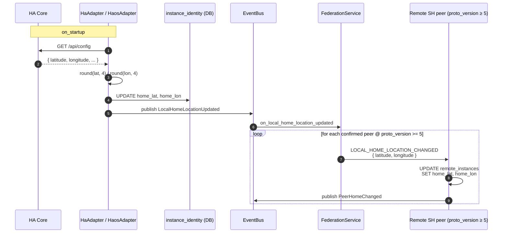
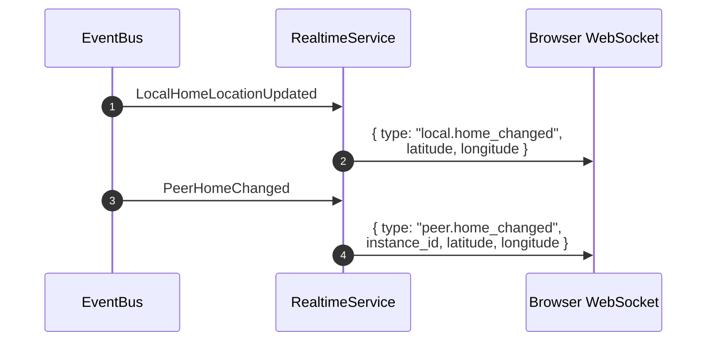

# Home location (federation map)

The home-location surface lets every household broadcast its physical
coordinates to confirmed peers so a map view can show where each paired
household sits in the world. Coordinates are coarse — truncated to 4
decimal places (~11 m) per §GPS-truncation, which is precise enough for
a city-level pin but not a street address.

## Scope

- **HFS**: both sides. HA / HAOS adapters read `latitude` / `longitude`
  from HA Core's `/api/config` on startup and push the value to peers.
  All HFS builds receive and render inbound location events.
- **GFS**: uninvolved. Home-location events never leave the pair mesh.

## Event types

`LOCAL_HOME_LOCATION_CHANGED`.

## Flow — initial location broadcast

Peers with `proto_version < 5` are silently skipped — they do not
receive the event and retain whatever coordinates were last stored
(or no coordinates if none were ever exchanged). When the peer
upgrades and the sender's next startup fires, the event is delivered
normally.

## Flow — realtime SPA update

Both `LocalHomeLocationUpdated` and `PeerHomeChanged` are also
consumed by `RealtimeService`, which fans the data straight to
every connected browser client:

The SPA's Connections page subscribes to both frames and updates
the Leaflet map pins in-place without a page reload.

## Location seeded at pairing time

When B scans A's QR and sends `PAIRING_PEER_ACCEPT`, B includes
its `home_lat` / `home_lon` in the body if both values are set (see
[`pairing.md`](./pairing.md) — `PAIRING_PEER_ACCEPT` body fields).
A stores the coordinates on B's `remote_instances` row immediately
so the Map tab shows B's pin as soon as the pair is confirmed,
without waiting for a subsequent `LOCAL_HOME_LOCATION_CHANGED`
broadcast.

## GPS precision

All latitude / longitude values are truncated to **4 decimal places**
before any storage or transmission — `round(float(val), 4)`. This
applies at three enforcement points:

1. **Adapter `on_startup`** — when the value is read from HA Core.
2. **Pairing coordinator** — when `home_lat` / `home_lon` arrive in
   the `PAIRING_PEER_ACCEPT` body.
3. **Inbound handler** — when `LOCAL_HOME_LOCATION_CHANGED` is
   processed.

Raw device precision is never stored. See [`../principles.md`](../principles.md)
§ GPS truncation and [`../database.md`](../database.md) conventions.

## SPA — Connections Map tab

The Connections page exposes a **List | Map** tab toggle. The Map tab
renders an OpenStreetMap canvas (Leaflet) with:

- The own household's pin, using the `instance_identity.home_lat /
  home_lon` value from `GET /api/pairing/connections`.
- One pin per confirmed peer that has coordinates, marked with a
  transport-indicator badge (⚡ WebRTC DataChannel, ☁ HTTPS inbox).
- A distance and 8-point compass bearing popup when a pin is tapped.
- A "Not on map" footer listing peers whose coordinates are NULL (e.g.
  standalone instances without a configured location).

## Implementation pointers

- `socialhome/platform/ha/adapter.py` — `_persist_home_location_from_ha`
  writes coords on `HaAdapter.on_startup`.
- `socialhome/platform/haos/adapter.py` — same helper, same lifecycle
  hook.
- `socialhome/platform/ha_home_location.py` — shared helper that
  fetches `/api/config` and persists via `FederationRepo`.
- `socialhome/repositories/federation_repo.py` — `update_instance_home`
  updates `instance_identity`; `update_remote_instance_home` updates
  `remote_instances`.
- `socialhome/domain/events.py` — `LocalHomeLocationUpdated`,
  `PeerHomeChanged` (internal bus events).
- `socialhome/domain/federation.py` — `FederationEventType.LOCAL_HOME_LOCATION_CHANGED`,
  `FederationCapability.MIN_FOR_HOME_LOCATION_BROADCAST = 5`.
- `socialhome/domain/federation_capabilities.py` — `OURS = 5`,
  `FederationCapability.MIN_FOR_HOME_LOCATION_BROADCAST`.
- `socialhome/federation/federation_service.py` — subscribes to
  `LocalHomeLocationUpdated`, fans out to v5+ peers.
- `socialhome/services/federation_inbound/` — `_on_local_home_location_changed`
  inbound handler.
- `socialhome/services/realtime_service.py` — `_on_local_home_location_updated`
  and `_on_peer_home_changed` push WS frames.
- `client/src/features/connections/FederationMap.tsx` — Leaflet map
  component.
- `client/src/features/connections/_mapMath.ts` — distance + bearing
  helpers.

## Spec references

§25 (GPS precision rule), §11 (pairing bootstrap, `PAIRING_PEER_ACCEPT`
body), §4 (adapter on_startup lifecycle).
