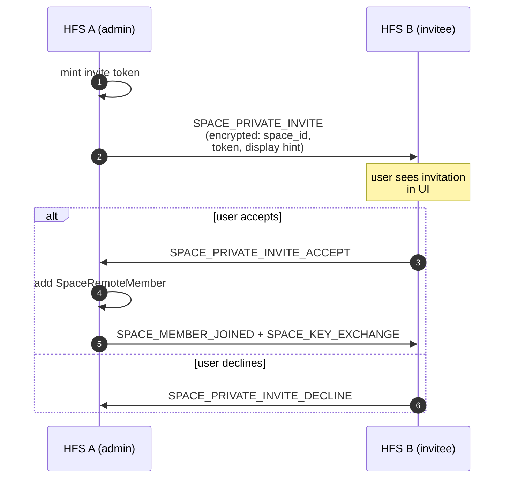
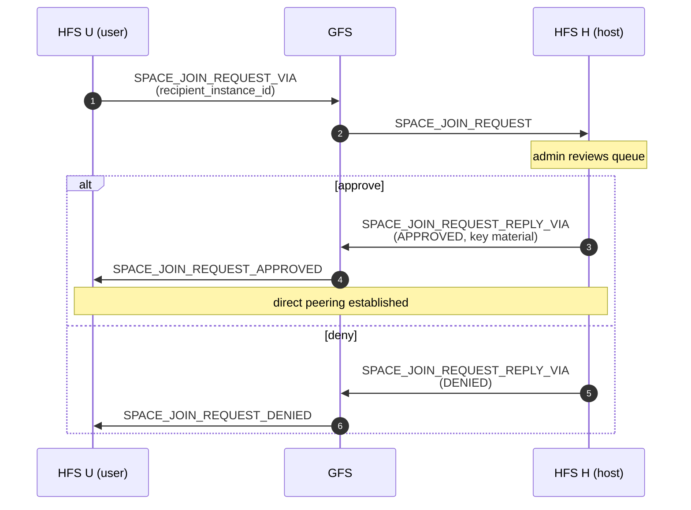

# Invites & Join Requests

Cross-household membership — how a user on HFS A ends up as a member
of a space hosted on HFS B. Two flows: admin-initiated private invites
and user-initiated join requests. Both are designed so GFS can relay
without ever seeing which space, which user, or which household.

## Scope

- **HFS**: mints invite tokens, stores pending invitations, handles
  accept/decline, publishes the resulting `SPACE_MEMBER_JOINED` event.
- **GFS**: only acts as an opaque relay for `_VIA` events between
  instances that are not yet directly paired.

## Event types

**Private invites** (admin → specific remote user)

`SPACE_PRIVATE_INVITE`, `SPACE_PRIVATE_INVITE_ACCEPT`,
`SPACE_PRIVATE_INVITE_DECLINE`, `SPACE_REMOTE_MEMBER_REMOVED`.

**Open invites / join requests**

`SPACE_INVITE`, `SPACE_INVITE_VIA`, `SPACE_ACCEPT`,
`SPACE_JOIN_REQUEST`, `SPACE_JOIN_REQUEST_VIA`,
`SPACE_JOIN_REQUEST_REPLY_VIA`, `SPACE_JOIN_REQUEST_APPROVED`,
`SPACE_JOIN_REQUEST_DENIED`, `SPACE_JOIN_REQUEST_EXPIRED`,
`SPACE_JOIN_REQUEST_WITHDRAWN`.

**Token-based invite redeem** (receiver-initiated, no admin approval —
the token IS the approval)

`SPACE_INVITE_TOKEN_REDEEM`, `SPACE_INVITE_TOKEN_REDEEM_ACK`,
`SPACE_INVITE_TOKEN_REDEEM_DENY`.

Used when a member shares a `socialhome://invite#…` code with someone
on a paired peer instance. The receiver pastes the code locally; their
backend recognises ``issuer_instance_id`` as a CONFIRMED peer and
sends ``SPACE_INVITE_TOKEN_REDEEM`` to the issuer carrying the token
and the receiving user's identity. The issuer validates the token
(exists, not expired, ``uses_remaining > 0``), atomically decrements,
seats the receiver as a ``SpaceRemoteMember`` + records the
``(space, instance)`` mapping, then sends ``SPACE_INVITE_TOKEN_REDEEM_ACK``
back with ``{space_id, role}``. Any failure (token unknown, expired,
exhausted, banned, persistence error) → ``SPACE_INVITE_TOKEN_REDEEM_DENY``
with a string ``reason``.

The receiver awaits the ACK on a nonce-keyed Future inside the
``POST /api/spaces/join`` handler (10 s timeout). On success the
endpoint returns ``{space_id, role}`` like the local path; on DENY
returns 422 with the reason; on timeout returns 504.

## Flow — private invite (paired peers)

## Flow — join request via GFS relay

Used when a user wants to join a public space hosted on an HFS they
aren't paired with. The GFS forwards the opaque `_VIA` envelope
without ever decrypting it.

## Receiver-side handoff (SPA)

The SPA layers three equivalent artifacts on top of the same backend
invite token so the receiver can choose the easiest channel:

- **Invite code** — `socialhome://invite#<base64url(JSON)>`. Single-line,
  chat-safe. The receiver pastes it into their own Social Home's
  Spaces → "Join with invite code" card. The payload sits in the URL
  fragment so a stray paste into a browser address bar never sends the
  token to anyone's server logs.
- **Link** — an HTTPS URL anchored on the issuer's `document.baseURI`
  (so the HA Supervisor ingress prefix is honoured rather than skipped).
  Lands on `SpaceJoinLanding` which redeems the token via
  `POST /api/spaces/join`. When the receiver follows this link from
  the wrong instance, the landing renders the same token back as an
  invite code + QR so the receiver can finish the handoff on their own
  home.
- **QR** — encodes the `socialhome://invite#…` form. For same-room
  handoffs.

The wire contract between client and server is unchanged: only
`{token}` ever travels in the `POST /api/spaces/join` body. The
metadata in the encoded JSON (space_id, space_display_hint,
issuer_instance_url) is for client-side preview + wrong-instance
detection only — the server never sees it.

## Zero-leak guarantee (§D1b)

Every field that would identify which space, which invitee, or which
admin is inside the encrypted payload. GFS sees only:

- `event_type` (category, not target)
- `from_instance` / `to_instance` (routing)
- `epoch` (for replay cache)

This holds even when both the inviter and invitee are brand-new to
each other — the invitation carries enough material for the invitee
to pair with the host after accepting, not before.

## Removal

`SPACE_REMOTE_MEMBER_REMOVED` is the counterpart to
`SPACE_MEMBER_LEFT` for cross-household membership: when an admin
removes a remote user, the host broadcasts this event to the user's
home instance so the UI clears local state.

## Implementation

Backend (federation + persistence):

- `socialhome/services/federation_inbound/space_invites.py` —
  inbound handlers.
- `socialhome/federation/private_invite_handler.py` — encrypted
  private-invite logic.
- `socialhome/services/space_service.py` —
  `invite_remote_user()`, `accept_remote_invite()`,
  `decline_remote_invite()`, `request_join_remote()`,
  `create_invite_token()`, `accept_invite_token()`.
- `socialhome/repositories/space_invitation_repo.py` — pending
  invitations.
- `socialhome/routes/spaces.py` — REST endpoints
  (`/api/spaces/{id}/invite-tokens`, `/api/spaces/{id}/remote-invites`,
  `/api/spaces/join`, `/api/remote_invites/{token}/accept|decline`).

SPA (issuer + receiver side):

- `client/src/lib/spaceInviteCode.ts` — `socialhome://invite#…`
  build / decode. Decoder accepts the URI form, raw JSON, and bare
  hex tokens.
- `client/src/components/SpaceInviteDialog.tsx` — issuer-side share
  dialog with code / link / QR.
- `client/src/components/RemoteInviteDialog.tsx` — admin-side
  targeted-peer picker over `/api/friends`.
- `client/src/features/spaces/SpaceJoinByCodeCard.tsx` — receiver-side
  paste-or-scan card on the Spaces dashboard.
- `client/src/features/spaces/SpaceJoinLanding.tsx` — legacy
  `/join?token=…` deep-link handler with wrong-instance fallback.

## Spec references

§D1b (zero-leak cross-household invites),
§25.8.20 (session keys in accepted invites),
§25.8.21 (encryption-first rule).
