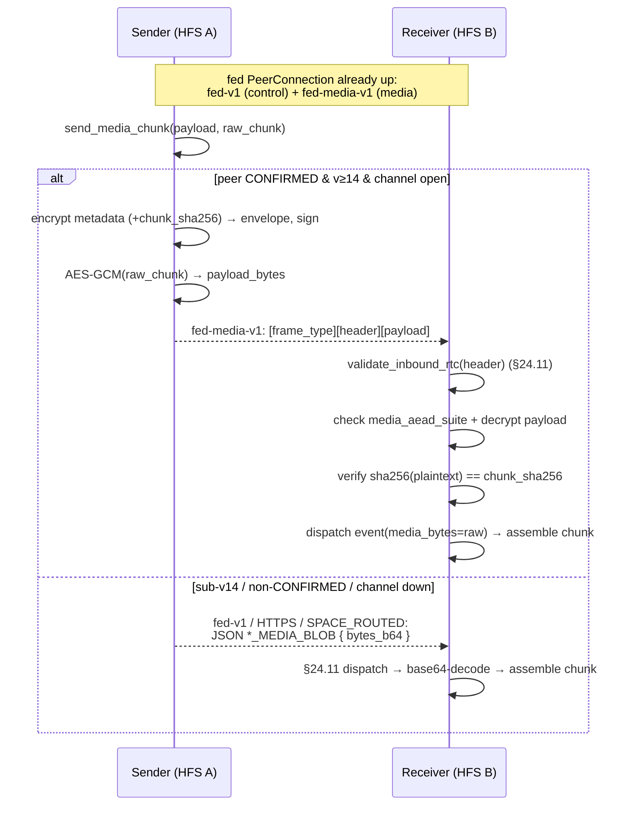

# Media transport — the binary `fed-media-v1` channel

## Summary

Cross-household media (DM attachments and space-post / gallery images)
is delivered as **chunks**. Two transports carry those chunks:

1. **JSON over `fed-v1`** (the original path) — each chunk is a
   base64 string inside the `DM_MEDIA_BLOB` / `SPACE_MEDIA_BLOB`
   federation envelope, AES-256-GCM-encrypted like any event and sent
   on the shared `fed-v1` control DataChannel (or HTTPS inbox /
   `SPACE_ROUTED` on fallback).
2. **Binary over `fed-media-v1`** (capability **v_14**) — a second
   DataChannel multiplexed on the *same* federation `PeerConnection`
   carries each chunk as a length-prefixed binary frame with the raw
   bytes encrypted directly (no base64).

The binary path exists because the JSON path inflates media ~1.77× on
the wire (base64 of the chunk, then base64 of the ciphertext) **and**
forces multi-hundred-KB media frames through the same ordered SCTP
stream as latency-sensitive control events (presence, typing,
reactions) — head-of-line blocking. A second SCTP DataChannel is an
independent stream, so big media no longer blocks control traffic, and
it rides the existing PeerConnection: no extra ICE / DTLS / TURN
handshake.

## Scope

- **Point-to-point only.** The binary channel exists between two
  **CONFIRMED direct peers**. A non-CONFIRMED or mesh-only space member
  (reachable only via a `SPACE_ROUTED` relay) never uses it — that
  member keeps receiving the JSON `SPACE_MEDIA_BLOB` over the mesh.
- **Capability-gated.** The sender uses the binary channel only when
  the peer advertises `proto_version ≥ 14`
  (`FederationCapability.MIN_FOR_MEDIA_CHANNEL`) **and** is CONFIRMED
  **and** the channel is currently open. Any miss falls back
  transparently to the JSON path.
- **Encryption-first (§25.8.21).** The raw chunk is AES-256-GCM
  encrypted under the directional session key; nothing media-bearing
  ever crosses the wire in cleartext.

## Frame format

Every frame on `fed-media-v1`:

```
[u8 frame_type][u32 header_len BE][header_bytes][u32 payload_len BE][payload_bytes]
```

- **`frame_type`** — `1` = `MEDIA_CHUNK` (v1). Forward-compatible: a
  receiver skips an unknown type rather than erroring, so future frame
  kinds (flow-control, resume) can share the channel without a new
  label.
- **`header_bytes`** — the signed federation **envelope JSON**,
  verbatim. It is the *same* shape `send_event` builds (`msg_id`,
  `event_type` = `dm_media_blob` / `space_media_blob`, `from_instance`,
  `to_instance`, `timestamp`, `space_id`, `proto_version`, `sig_suite`,
  `signatures`, `encrypted_payload`). The framing layer treats it as
  opaque so the exact signed bytes are re-parsed by the §24.11
  pipeline.
- **`payload_bytes`** — `nonce(12) ‖ AES-256-GCM(raw_chunk)`. Raw
  binary, never base64.

The envelope's `encrypted_payload` is the AES-256-GCM-encrypted **chunk
metadata** (the same fields the JSON `*_MEDIA_BLOB` payload carries —
`media_blob_id` / `message_id` / `filename` / `transfer_id` /
`chunk_index` / `chunk_count` / `final` / … — but **without**
`bytes_b64`), plus two media fields:

- `media_aead_suite` — `"aesgcm-256"`, validated against
  `SUPPORTED_MEDIA_AEAD_SUITES`; unknown suites are rejected with no
  default fallback (the project-wide crypto-suite rule).
- `chunk_sha256` — b64url SHA-256 of the **plaintext** chunk. This is
  the binding (see Security).

## Security model

The binary frame inherits every §24.11 guarantee unchanged, because the
header **is** a normal federation envelope and the receiver runs it
through the same validation pipeline (`validate_inbound_rtc`):

- **Origin authentication** — Ed25519 (suite-aware) signature over the
  envelope. The signed-byte reconstruction in `make_verify_signature` is
  untouched.
- **Replay** — the envelope's `msg_id` against the existing replay
  cache; each chunk is its own envelope with its own `msg_id`.
- **Timestamp / ban / idempotency / deprovisioned-author** — same
  pipeline steps; an `early_response` short-circuit skips assembly.
- **Confidentiality** — chunk + metadata both AES-256-GCM under the
  directional session key.

**Binding the binary payload to the signed envelope.** `chunk_sha256`
lives *inside* the AES-GCM-encrypted, signature-covered metadata. So:

- tampering with `payload_bytes` → the receiver's `sha256(plaintext)`
  check fails;
- tampering with `chunk_sha256` → the GCM tag (or the envelope
  signature) fails;
- swapping payloads between two valid frames → each frame's
  `chunk_sha256` commits to its own chunk, and re-delivering an
  identical frame is dropped by the replay cache.

The receiver verifies `sha256(plaintext) == chunk_sha256` **after** GCM
decryption (constant-time compare), so the hash binds the exact bytes
written to disk. Both the metadata AEAD and the chunk AEAD draw a fresh
random 96-bit nonce; the shared-key message count stays many orders of
magnitude below the GCM birthday bound for any realistic peer lifetime
(see [`../crypto.md`](../crypto.md)).

## Flow



Both paths converge on the same receiver assembly
(`_assemble_dm_chunk` / `_assemble_space_chunk`): the handlers prefer
`event.media_bytes` (binary path) and fall back to base64 `bytes_b64`
(JSON path), so chunking, part-file reassembly, and the
`dm.media_ready` WebSocket notify are identical regardless of transport.

## Implementation pointers

- Framing: [`socialhome/federation/media_framing.py`](../../socialhome/federation/media_framing.py)
- Channel lifecycle + `send_media`: [`socialhome/federation/transport.py`](../../socialhome/federation/transport.py) (`_RtcPeer`, `FederationTransport.send_media`)
- Send + receive + per-chunk crypto: [`socialhome/federation/federation_service.py`](../../socialhome/federation/federation_service.py) (`send_media_chunk`, `handle_inbound_media_frame`, `validate_inbound_rtc`)
- Raw-bytes AEAD: [`socialhome/federation/encoder.py`](../../socialhome/federation/encoder.py) (`encrypt_bytes` / `decrypt_bytes`)
- Senders: [`dm_media_sync_service.py`](../../socialhome/services/dm_media_sync_service.py), [`space_media_sync_service.py`](../../socialhome/services/space_media_sync_service.py)
- Receiver assembly: [`federation_inbound_service.py`](../../socialhome/services/federation_inbound_service.py)
- Capability: [`socialhome/domain/federation_capabilities.py`](../../socialhome/domain/federation_capabilities.py) (`MIN_FOR_MEDIA_CHANNEL`)

## Spec refs

§24.11 (inbound validation pipeline), §24.12 (WebRTC transport),
§25.8.21 (encryption-first), capability versioning
([`capabilities.md`](./capabilities.md)), DM media
([`dm-media.md`](./dm-media.md)).
