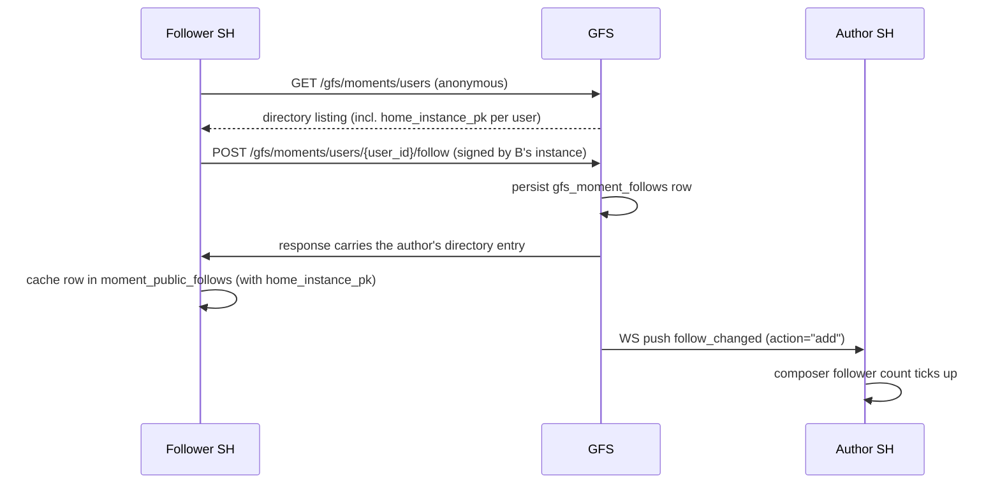
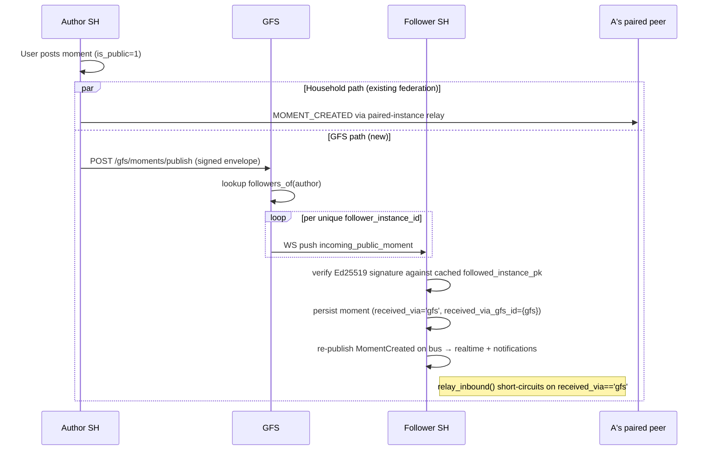
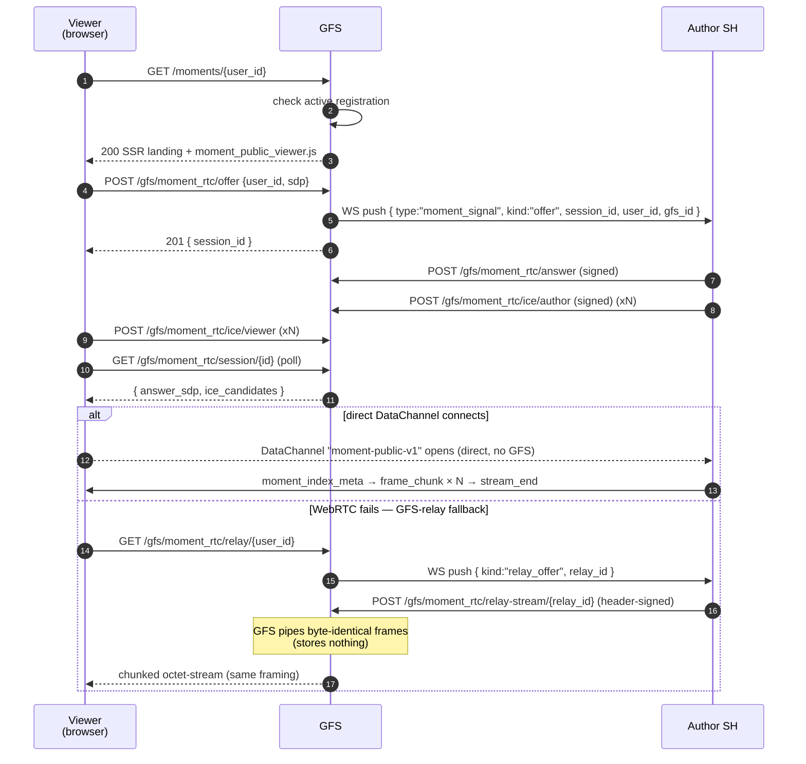

# Public Momentum (§Momentum-public)

Opt-in extension to the [Momentum](momentum.md) pillar that lets a
registered user fan their moments out beyond the household-paired
mesh, brokered by a GFS. Followers across the public internet
discover authors via the GFS directory, follow them explicitly, and
receive every subsequent moment over the same persistent SH↔GFS
WebSocket the rest of the public-pillar surface (Highlights) already
uses.

## Scope

* Per-user opt-in. The author of each moment chooses whether to fan
  it out via their registered GFSes; an opt-out checkbox at compose
  time overrides the per-user default.
* Multi-GFS publishing. One user can register on several GFSes at
  once. The fan-out posts to each in turn.
* Follower-side gate. The GFS only forwards a moment to households
  that have at least one follower of the author. Strangers see
  nothing.
* **No re-distribute rule.** A moment that arrived via a GFS
  fan-out is *not* relayed back into the recipient's paired
  household mesh. The federation outbound (`MomentFederationOutbound.relay_inbound`)
  reads `received_via='gfs'` on the inbound payload and skips relay.
* Replies fan out **both** through the GFS path and through the
  replier's paired households (normal moment federation).
* Author-side moments still fan out to paired households via the
  existing federation alongside the GFS path. Recipients dedupe by
  `moment.id` (the `moments` PRIMARY KEY makes the second save a
  no-op).

## Encryption posture

Per §25.8.21 (encryption-first), the GFS sees the absolute minimum
needed to route. For public Momentum:

* The author's instance **signs** the moment envelope (Ed25519 over
  the canonical JSON of every field except ``signature``).
* The GFS holds plaintext **only in memory** during fan-out. It is
  never persisted on the GFS — `gfs_moments` does not exist as a
  table; the broker reads the envelope, looks up follower instances,
  pushes the frame to each, and discards.
* Recipients verify the signature against the author's
  `home_instance_pk` cached in `moment_public_follows` at follow
  time. A bad signature drops the frame on the floor.

## Event types

| Event type (federation) | Direction | Purpose |
|---|---|---|
| `MOMENT_PUBLIC_FOLLOW` | GFS → author | Follower count tick. |
| `MOMENT_PUBLIC_UNFOLLOW` | GFS → author | Follower count tick. |

The moment payload itself rides as a **WS frame**, not a federation
event — the GFS is the validated middlebox and the recipient
verifies the author's signature directly.

| WS frame type | Direction | Carries |
|---|---|---|
| `moment_public` | author SH → GFS (HTTP `POST /gfs/moments/publish`) | Signed moment envelope. |
| `moment_public_delete` | author SH → GFS (HTTP `POST /gfs/moments/delete`) | Signed tombstone. |
| `incoming_public_moment` | GFS → follower SH | Forwarded envelope, signature intact. |
| `incoming_public_moment_delete` | GFS → follower SH | Forwarded tombstone. |
| `follow_changed` | GFS → author SH | Notifies the author about follower count change. |

## Wire endpoints

### GFS-side

| Method | Path | Purpose |
|---|---|---|
| POST   | `/gfs/moments/users/register` | Signed body — register a user. |
| POST   | `/gfs/moments/users/{user_id}/deregister` | Signed body — drop a registration. |
| POST   | `/gfs/moments/users/{user_id}/follow` | Signed body — record a follower. |
| POST   | `/gfs/moments/users/{user_id}/unfollow` | Signed body — drop a follower. |
| POST   | `/gfs/moments/users/{user_id}/picture` | Signed body — push avatar bytes. |
| POST   | `/gfs/moments/publish` | Signed envelope — fan out to followers. |
| POST   | `/gfs/moments/delete` | Signed tombstone — fan out the delete. |
| GET    | `/gfs/moments/users` | Public JSON directory. |
| GET    | `/gfs/moments/users/{user_id}` | Public JSON per-user detail. |
| GET    | `/gfs/moments/users/{user_id}/picture` | Public avatar bytes. |
| GET    | `/moments` | Public HTML directory. |
| GET    | `/moments/{user_id}` | Per-user public HTML landing; mounts the live public-moments index viewer (see "Public moments index"). |

### SH-side (auth-gated)

| Method | Path | Purpose |
|---|---|---|
| GET    | `/api/moments/public/registrations` | Caller's registrations. |
| POST   | `/api/moments/public/registrations` | Register on a GFS. |
| DELETE | `/api/moments/public/registrations/{gfs_id}` | Deregister. |
| PATCH  | `/api/moments/public/registrations/{gfs_id}` | Toggle `default_share`. |
| GET    | `/api/moments/public/follows` | Caller's GFS follows. |
| POST   | `/api/moments/public/follows` | Follow another author. |
| DELETE | `/api/moments/public/follows/{gfs_id}/{user_id}` | Unfollow. |
| GET    | `/api/gfs/{gfs_id}/moments/users` | Proxy the GFS directory. |

## Sequence: discover + follow



## Sequence: publish + fan-out



If A's paired-household mesh and B's mesh overlap (same household
pair), B receives the same ``moment_id`` twice — once via federation,
once via GFS. The recipient dedupes on the row's PRIMARY KEY; the
second save is a no-op.

## Signature canonicalisation

Every signed wire body — register, follow, unfollow, publish, delete
— uses the same canonical-JSON shape:

```python
canonical = json.dumps(
    body, separators=(",", ":"), sort_keys=True
).encode("utf-8")
```

The Ed25519 signature is computed over those bytes, base64url-encoded
(no padding), and appended to the body under the ``signature`` key.
The ``signature`` field is **excluded** from the canonical bytes —
the verifier strips it back out before re-running ``json.dumps`` to
compare.

* **Algorithm**: Ed25519 (per §25.8 instance-key suite).
* **Key**: the sending instance's federation identity key (32-byte
  Ed25519 seed). For follower-side calls (``follow`` / ``unfollow``)
  the follower's *own* instance signs; for publish / delete the
  author's instance signs.
* **Public key encoding**: 64-character lowercase hex on every
  GFS-stored or wire-carried form (``client_instances.public_key``,
  ``gfs_user_registrations.home_instance_pk``,
  ``moment_public_follows.followed_instance_pk``). The choice of hex
  for keys + base64url for signatures matches the existing
  Highlights flow.
* **Nonce**: none. Replay protection is provided at the transport
  layer (the GFS only routes within an active WS), and the moment
  envelope's ``moment_id`` is unique per author.

The recipient's verification is in
``socialhome/services/moment_public_inbound.py:_verify`` — single
``json.dumps(..., separators=(",",":"), sort_keys=True)`` call,
identical bytes-for-bytes to the sender's canonical encoding.

## DB schema (this PR ships into `0001_initial.sql`)

* `gfs_user_registrations` (GFS) — directory of opted-in users.
  Carries `bio` (≤280 chars) and `picture_digest` so the public
  directory landing renders cards without joining
  `gfs_user_pictures`.
* `gfs_user_pictures` (GFS) — avatar bytes mirrored from the home
  instance so the anon `/moments` SPA + `/moments/{id}` detail page
  can serve `">` without round-
  tripping to the (often NAT-shielded) household.
* `gfs_moment_follows` (GFS) — follower graph keyed by
  `(follower_user_id, followed_user_id)`.
* `moment_public_registrations` (SH) — author-side opt-in per
  `(user_id, gfs_id)`, plus the `default_share` flag and
  `last_picture_digest` so the profile-sync flow skips redundant
  avatar uploads.
* `moment_public_follows` (SH) — follower-side cache, including the
  followed user's `home_instance_pk` for signature verification.
* `moments.is_public` / `moments.received_via` /
  `moments.received_via_gfs_id` — provenance on every row so the
  inbox UI can render a "via {gfs}" chip and so the federation
  outbound can enforce the no-redistribute rule.

## Public directory + profile sync

* **Anon landing** at `/moments` (SPA shell) and `/moments/{user_id}`
  (per-user detail) — both rendered by the GFS itself; the JS at
  `/static/users_directory.js` fetches `GET /gfs/moments/users` and
  renders cards with avatar + name + bio + handle.
* **Per-user detail JSON** at `GET /gfs/moments/users/{user_id}` —
  adds `follower_count` to the registration shape so the detail
  page can show social proof.
* **Server-side filter** `GET /gfs/moments/users?q=<substr>` matches
  `display_name` and `username` (`LIKE '%q%'`). Capped at 200
  rows; the SH-side proxy passes `q` through.
* **In-app Discover** at `/momentum/public/discover` — fetches
  `GET /api/gfs/{gfs_id}/moments/users` (SH proxy), rendering avatar
  via `GET /api/gfs/{gfs_id}/moments/users/{user_id}/picture` so the UI
  renders even when the home instance is NAT-shielded.
* **Profile sync** — `UserProfileUpdated` (published from
  `UserService.patch_profile` and `set_picture`) is consumed by
  `ProfileSyncService`, which calls
  `MomentPublicService.push_profile_to_gfs` once per active
  registration. Failures log + drop; reconcile happens on the
  next save.
* **Single identity** — there is no per-Momentum profile override
  in v1. What's in `users.{display_name, bio, picture_hash}` is
  what every paired GFS sees.

## Public moments index

A guest visiting `GET /moments/{user_id}` on the GFS sees the author's
**current public moments**, streamed live from the author's SH the same
way a public highlight is — a direct WebRTC DataChannel first, with the
GFS-relay fallback when WebRTC can't connect. The transport mechanism is
shared verbatim with Highlights; see
[highlights_public.md → GFS-relay fallback](highlights_public.md#gfs-relay-fallback)
for the bridge details rather than repeating them here.

Access is gated by the user's **active public-directory registration** —
no token. Only moments with `is_public = 1` that have not expired are
ever streamed; the filter is enforced in
`moment_repo.list_public_for` (the privacy invariant). The GFS stores
**zero** moment bytes — like the highlight relay, the bridge is a
transient in-memory pipe.

### Framing

The moments index reuses the highlights framing module
(`highlight_public_framing.py`) — same `[u32 header_len][header][u32
payload_len][payload]` shape, label `moment-public-v1`:

| `kind` | Direction | Header fields | Payload |
|---|---|---|---|
| `moment_index_meta` | author → viewer (first frame) | `moments` (manifest: `[{id, content, created_at, media_type, has_media, media_frame_id, byte_length?, content_type?}, …]`) | empty |
| `frame_chunk` | author → viewer | `frame_id`, `chunk_index`, `is_last_chunk`, `byte_length` | up to `CHUNK_SIZE` bytes — one stream per moment that has media |
| `stream_end` | author → viewer (terminator) | `kind` only | empty |

### Wire endpoints (GFS)

These mirror the public-highlight `/gfs/highlight_rtc/*` endpoints.

| Method | Path | Purpose |
|---|---|---|
| POST | `/gfs/moment_rtc/offer` | Anonymous. Body `{user_id, sdp}`. `404` if the user isn't registered / is suspended, `503` if the author is offline. Pushes a `moment_signal` WS frame (`kind:"offer"`, carrying `user_id` + `gfs_id`) to the author. Returns `{session_id}`. |
| GET | `/gfs/moment_rtc/session/{session_id}` | Anonymous poll for `answer_sdp` + author ICE. |
| POST | `/gfs/moment_rtc/ice/viewer` | Anonymous. Trickle the viewer's ICE candidate. |
| POST | `/gfs/moment_rtc/answer` | Author SH only (Ed25519-signed). Authority guard: `session.initiator_id` must match the signer. |
| POST | `/gfs/moment_rtc/ice/author` | Author SH only (signed). Same authority guard. |
| GET | `/gfs/moment_rtc/relay/{user_id}` | Anonymous chunked relay fallback (registration-gated). `404` unregistered, `503` author offline / never connects. |
| POST | `/gfs/moment_rtc/relay-stream/{relay_id}` | Author SH only. Header-auth (`X-SH-Instance` + `X-SH-Signature` over canonical `{"instance_id","relay_id"}`) — same scheme as the highlight relay-stream. Body is the raw framed byte stream. |

The author SH handles a new `moment_signal` WS frame with `kind` ∈
`offer` / `ice` / `relay_offer`, dispatched in
`moment_public_signaling_handler.py`. The viewer DataChannel label is
`moment-public-v1`; the bundle is `moment_public_viewer.js` (built from
`client/gfs/public_moments.tsx`) and mounts into `#moments-root` on the
per-user landing page.

### Sequence: guest reads a user's public moments



Only `is_public = 1`, non-expired moments cross the wire — a stranger
visiting the page sees exactly the author's current public set, never a
private or expired moment, and the GFS never holds a copy.

## Implementation pointers

* SH author orchestration:
  `socialhome/services/moment_public_service.py`,
  `socialhome/services/moment_public_outbound.py`.
* SH recipient:
  `socialhome/services/moment_public_inbound.py`.
* GFS broker:
  `socialhome/global_server/moment_public_registry.py`.
* GFS routes:
  `socialhome/global_server/routes/moments_public.py`.
* SH routes:
  `socialhome/routes/moments_public.py`.
* Relay guard:
  `socialhome/services/moment_federation_outbound.py:relay_inbound`.
* Public moments index (author-side answerer / relay):
  `socialhome/services/moment_public_signaling_handler.py`.
* Public moments index (GFS RTC + relay routes):
  `socialhome/global_server/routes/moment_rtc.py`.
* Public moments index viewer bundle:
  `client/gfs/public_moments.tsx` → `moment_public_viewer.js`.
* Privacy filter:
  `socialhome/repositories/moment_repo.py:list_public_for`.

## Spec refs

* §Momentum (the underlying pillar; this page extends it).
* §24.7 GFS pairing handshake.
* §24.12 SH↔GFS WebSocket transport.
* §25.8.21 Encryption-first invariant.
