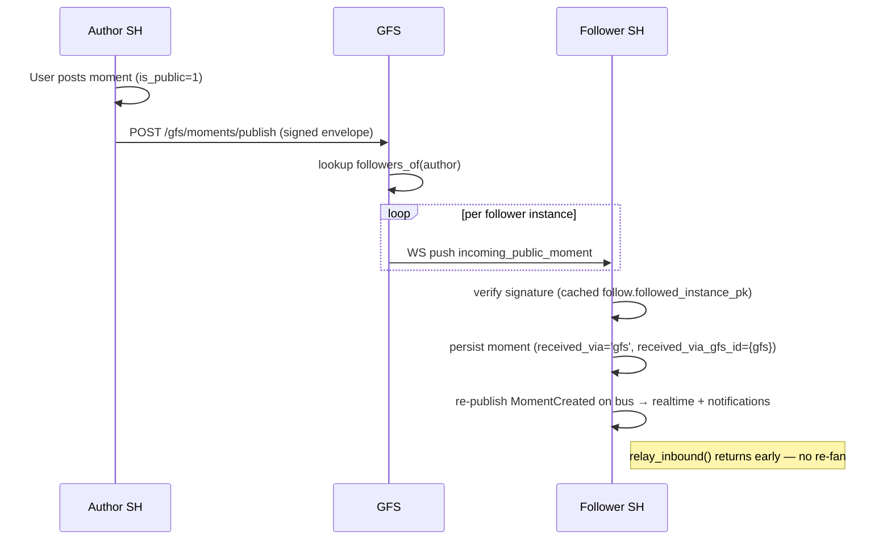

# Public Momentum (§Momentum-public)

Opt-in extension to the [Momentum](momentum.md) pillar that lets a
registered user fan their moments out beyond the household-paired
mesh, brokered by a GFS. Followers across the public internet
discover authors via the GFS directory, follow them explicitly, and
receive every subsequent moment over the same persistent SH↔GFS
WebSocket the rest of the public-pillar surface (Highlights) already
uses.

## Scope

* Per-user opt-in. The author of each moment chooses whether to fan
  it out via their registered GFSes; an opt-out checkbox at compose
  time overrides the per-user default.
* Multi-GFS publishing. One user can register on several GFSes at
  once. The fan-out posts to each in turn.
* Follower-side gate. The GFS only forwards a moment to households
  that have at least one follower of the author. Strangers see
  nothing.
* **No re-distribute rule.** A moment that arrived via a GFS
  fan-out is *not* relayed back into the recipient's paired
  household mesh. The federation outbound (`MomentFederationOutbound.relay_inbound`)
  reads `received_via='gfs'` on the inbound payload and skips relay.
* Replies fan out **both** through the GFS path and through the
  replier's paired households (normal moment federation).
* Author-side moments still fan out to paired households via the
  existing federation alongside the GFS path. Recipients dedupe by
  `moment.id` (the `moments` PRIMARY KEY makes the second save a
  no-op).

## Encryption posture

Per §25.8.21 (encryption-first), the GFS sees the absolute minimum
needed to route. For public Momentum:

* The author's instance **signs** the moment envelope (Ed25519 over
  the canonical JSON of every field except ``signature``).
* The GFS holds plaintext **only in memory** during fan-out. It is
  never persisted on the GFS — `gfs_moments` does not exist as a
  table; the broker reads the envelope, looks up follower instances,
  pushes the frame to each, and discards.
* Recipients verify the signature against the author's
  `home_instance_pk` cached in `moment_public_follows` at follow
  time. A bad signature drops the frame on the floor.

## Event types

| Event type (federation) | Direction | Purpose |
|---|---|---|
| `MOMENT_PUBLIC_FOLLOW` | GFS → author | Follower count tick. |
| `MOMENT_PUBLIC_UNFOLLOW` | GFS → author | Follower count tick. |

The moment payload itself rides as a **WS frame**, not a federation
event — the GFS is the validated middlebox and the recipient
verifies the author's signature directly.

| WS frame type | Direction | Carries |
|---|---|---|
| `moment_public` | author SH → GFS (HTTP `POST /gfs/moments/publish`) | Signed moment envelope. |
| `moment_public_delete` | author SH → GFS (HTTP `POST /gfs/moments/delete`) | Signed tombstone. |
| `incoming_public_moment` | GFS → follower SH | Forwarded envelope, signature intact. |
| `incoming_public_moment_delete` | GFS → follower SH | Forwarded tombstone. |
| `follow_changed` | GFS → author SH | Notifies the author about follower count change. |

## Wire endpoints

### GFS-side

| Method | Path | Purpose |
|---|---|---|
| POST   | `/gfs/users/register` | Signed body — register a user. |
| POST   | `/gfs/users/{user_id}/deregister` | Signed body — drop a registration. |
| POST   | `/gfs/users/{user_id}/follow` | Signed body — record a follower. |
| POST   | `/gfs/users/{user_id}/unfollow` | Signed body — drop a follower. |
| POST   | `/gfs/moments/publish` | Signed envelope — fan out to followers. |
| POST   | `/gfs/moments/delete` | Signed tombstone — fan out the delete. |
| GET    | `/gfs/users` | Public JSON directory. |
| GET    | `/users` | Public HTML directory. |

### SH-side (auth-gated)

| Method | Path | Purpose |
|---|---|---|
| GET    | `/api/moments/public/registrations` | Caller's registrations. |
| POST   | `/api/moments/public/registrations` | Register on a GFS. |
| DELETE | `/api/moments/public/registrations/{gfs_id}` | Deregister. |
| PATCH  | `/api/moments/public/registrations/{gfs_id}` | Toggle `default_share`. |
| GET    | `/api/moments/public/follows` | Caller's GFS follows. |
| POST   | `/api/moments/public/follows` | Follow another author. |
| DELETE | `/api/moments/public/follows/{gfs_id}/{user_id}` | Unfollow. |
| GET    | `/api/gfs/{gfs_id}/users` | Proxy the GFS directory. |

## Sequence: publish + fan-out

## DB schema (this PR ships into `0001_initial.sql`)

* `gfs_user_registrations` (GFS) — directory of opted-in users.
* `gfs_moment_follows` (GFS) — follower graph keyed by
  `(follower_user_id, followed_user_id)`.
* `moment_public_registrations` (SH) — author-side opt-in per
  `(user_id, gfs_id)`, plus the `default_share` flag.
* `moment_public_follows` (SH) — follower-side cache, including the
  followed user's `home_instance_pk` for signature verification.
* `moments.is_public` / `moments.received_via` /
  `moments.received_via_gfs_id` — provenance on every row so the
  inbox UI can render a "via {gfs}" chip and so the federation
  outbound can enforce the no-redistribute rule.

## Implementation pointers

* SH author orchestration:
  `socialhome/services/moment_public_service.py`,
  `socialhome/services/moment_public_outbound.py`.
* SH recipient:
  `socialhome/services/moment_public_inbound.py`.
* GFS broker:
  `socialhome/global_server/moment_public_registry.py`.
* GFS routes:
  `socialhome/global_server/routes/moments_public.py`.
* SH routes:
  `socialhome/routes/moments_public.py`.
* Relay guard:
  `socialhome/services/moment_federation_outbound.py:relay_inbound`.

## Spec refs

* §Momentum (the underlying pillar; this page extends it).
* §24.7 GFS pairing handshake.
* §24.12 SH↔GFS WebSocket transport.
* §25.8.21 Encryption-first invariant.
