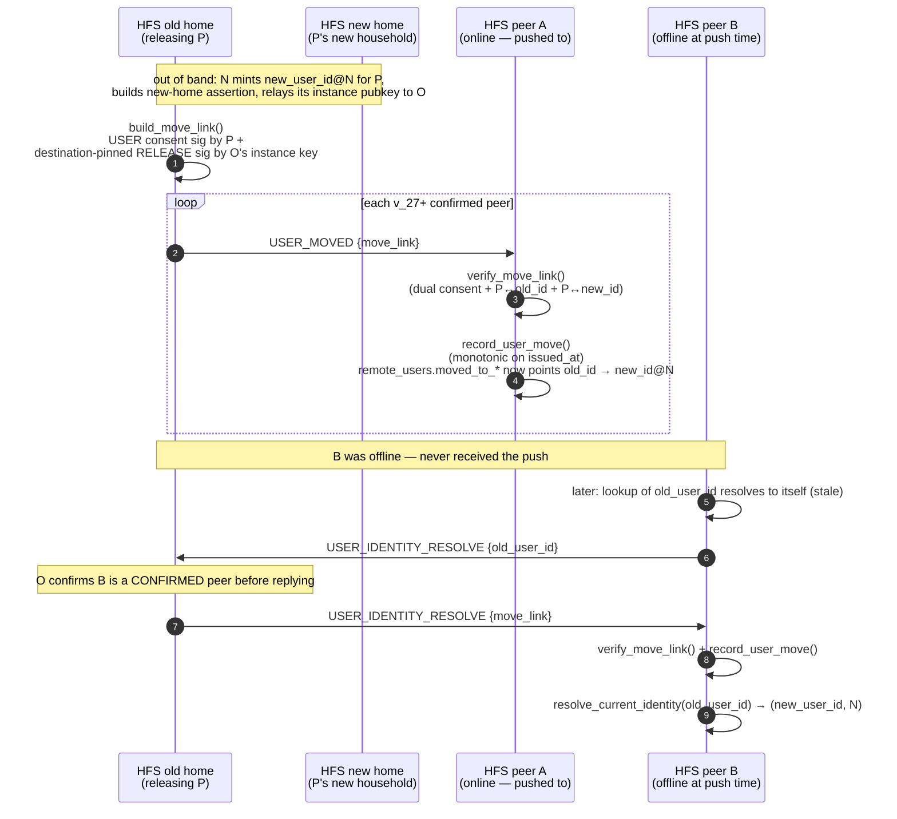

# Move-out (MO-1)

A person leaving one household to run their own keeps their social graph
**without re-keying their `user_id`**. Move-out (MO-1) ships the signed
**LINK** that redirects a person's old household-scoped identity to their new
one, plus the two events that distribute it.

The portable person-identity is the per-user Ed25519 pubkey `P` (independent
user identity, [Phase 1](./user-identity.md)). The household-scoped
`user_id = derive_user_id(instance_pk, identity_anchor)` is **provenance** — it
records which household a piece of content came from, and it deliberately does
**not** change when a person moves. A moved person gets a *new*
household-scoped `user_id` at the new home; their old content keeps the old
`user_id`. Move-out is a signed link `old_user_id@old_home → new_user_id@new_home`,
where both ends are bound to the same `P`. Receivers store the redirect so a
lookup of the stale id forwards to the current identity.

## Scope

- **HFS**: full participant. The *old* home builds + signs the release half of
  the link and pushes `USER_MOVED` to feature-capable peers; every peer
  verifies the link against keys it already holds and records the redirect.
  Any holder of the link serves the `USER_IDENTITY_RESOLVE` pull backstop to a
  confirmed peer.
- **GFS**: uninvolved. The link is exchanged only between paired households
  over the existing peer-to-peer channels.

## Event types

`USER_MOVED`, `USER_IDENTITY_RESOLVE`
(defined in `socialhome/domain/federation.py`).

| Event | Direction | Purpose |
|---|---|---|
| `USER_MOVED` | old home → every v_27+ peer (push) | Carries the dual-consent `MoveLink` in `payload.move_link`. The receiver re-verifies both signatures + both `P`-bindings, then records a monotonic forwarding pointer on the moved user's `remote_users` row. |
| `USER_IDENTITY_RESOLVE` | peer → link-holder, then link-holder → peer (pull) | Backstop for a peer that missed the push. The requester sends `{old_user_id}`; any **confirmed** peer holding the stored link replies with the same event type carrying `payload.move_link`. |

## The move-link

A `MoveLink` (`socialhome/domain/move_link.py`) is a self-verifying claim that
`P` moved from `old_user_id@old_instance_id` to a new home. It embeds the new
home's `UserIdentityAssertion` as the `P↔new_id` binding (so `new_user_id` /
`new_instance_id` are *read out of* that assertion, not duplicated on the link)
and carries the new home's instance pubkey, relayed by the old home, that the
binding is verified against.

Wire shape (`MoveLink.to_wire_dict`):

```
{
  "suite": "ed25519",
  "user_public_key": "<hex Ed25519 portable user pubkey P>",
  "old_user_id": "...",
  "old_instance_id": "...",
  "issued_at": "<ISO-8601 UTC, tz-aware>",
  "new_instance_public_key": "<hex Ed25519 pubkey of the new home>",
  "new_home_assertion": { ...UserIdentityAssertion wire dict... },
  "user_signature": "<base64url Ed25519 sig by P>",
  "release_signature": "<base64url Ed25519 sig by the old home's instance key>"
}
```

The `suite` tag follows the PQ-forward suite-id convention
(`MOVE_LINK_SUITE_ED25519` / `SUPPORTED_MOVE_LINK_SUITES` /
`UnsupportedMoveLinkSuite`): a receiver rejects an unknown suite with no
default fallback.

## Dual consent + destination pinning

Accepting a move requires **two independent signatures** plus **two bindings**,
all checked by `verify_move_link`:

1. **User consent** (`user_signature`) — `P` signs
   `move_link_user_signed_bytes`, proving the person authorised the move.
2. **Old-home release** (`release_signature`) — the old home's instance key
   signs `move_link_release_signed_bytes`, which **commits to**
   `new_user_id` + `new_instance_public_key`. This is the **destination-pin**:
   a release signed for one destination does not verify against any other, so
   the old home vouches for *this specific* destination, not a blank cheque.

And both `P`-bindings must hold:

- **`P↔old_id`** — the link's `P` must equal the `P` the receiver already
  stored for `old_user_id` (from the [Phase 1](./user-identity.md) binding),
  and the receiver's pinned old-home instance key must derive to
  `link.old_instance_id`.
- **`P↔new_id`** — the embedded `new_home_assertion` must verify against the
  relayed `new_instance_public_key` (and that key must derive to the
  assertion's `instance_id`), and the assertion must bind the **same** `P`.

Because the release is verified against the **pinned** old-home key and the new
binding against the **relayed-then-self-consistent** new-home key, an attacker
can neither swap in a different destination nor a different `P`.

## Replay guard — monotonic `issued_at`

A move is a **durable fact**, not a freshness-bounded message, so
`verify_move_link` runs with `max_age=None` (signatures + bindings still
verify; only the age gate is skipped). Replay is instead defended at the store:
`record_user_move` is **monotonic on `issued_at`** keyed by the stable
per-user row (`old_user_id`, the immutable pubkey-derived id). A redirect whose
`issued_at` is `<=` the one already on file raises `StaleMoveLink` and is
dropped — a replayed older link can never resurrect a stale identity.

## Resolving a stale id

`resolve_current_identity(user_id)` walks the `moved_to_user_id` chain to the
tip, returning `(current_user_id, current_instance_id)` of the row with no
further redirect (an unmoved row resolves to itself). The walk is cycle-guarded
with a `seen` set so a malformed chain can't loop forever.

## Flow

The old home pushes the link to confirmed, feature-capable peers; a peer that
was offline at push time later pulls the link and re-points.



The pull backstop is **confirmed-peers-only**: the §24.11 pipeline
authenticates the *sender*, but a merely-authenticated (or mid-pairing) peer
must not be able to enumerate a household's move destinations. A request from a
non-confirmed peer is logged and dropped with no reply.

Every inbound path is **fail-soft**: a malformed payload, an unknown peer, a
missing stored `P` binding, a failed signature/binding check, or a stale
(replayed) link is logged and dropped — the handler never raises out.

## Distribution — push + confirmed-peers-only pull

- **Push** — `UserMoveService.push_move_link` fans `USER_MOVED` to every peer
  that advertises `FederationCapability.MIN_FOR_USER_MOVE` (v_27), skipping
  older peers (the pull backstop covers them later).
- **Pull** — `USER_IDENTITY_RESOLVE` lets a peer that missed the push ask any
  link-holder for the stored link by `old_user_id`. The holder replies only to
  a **confirmed** peer.

## Older-peer fallback

A sub-v_27 peer is **not pushed** to and **cannot resolve** — it simply keeps
the stale contact pointing at `old_user_id@old_home`. There is **no data loss**
and **no auto-follow**: the moved person's old content stays attributed to the
old `user_id` as before, and the peer never silently re-points anywhere. Once
the peer upgrades, the pull backstop (or the next push) re-points it. Move-out
is a per-user surface (not space-scoped), so its lag affects only the
households tracking the moved user and is intentionally kept out of the
per-space compatibility banner.

## Not yet built (MO-2)

MO-1 ships the redirect link + its distribution only. Deferred to MO-2:

- **Carrying the keypair** — transplanting `P`'s private half to the new home so
  the person signs as the same `P` from there.
- **Re-pairing handshake** — re-establishing the new home's pair-level trust
  with the old graph's peers under the moved identity.
- **Space-membership transfer** — moving the person's space memberships and
  re-keying their access at the new home.
- **Data carve-out** — exporting / migrating the person's own content out of
  the old household.
- **UI** — the operator/user-facing move-out flow.

A documented follow-up on the resolve backstop: a **per-peer rate limit** on
`USER_IDENTITY_RESOLVE` requests (not yet implemented).

## Implementation

- `socialhome/crypto.py` — `MOVE_LINK_SUITE_ED25519` /
  `SUPPORTED_MOVE_LINK_SUITES` / `UnsupportedMoveLinkSuite` /
  `validate_move_link_suite`; `move_link_user_signed_bytes` /
  `move_link_release_signed_bytes` (the destination-pinned release bytes);
  `build_move_link`; `verify_move_link` (dual consent + both bindings,
  `max_age: timedelta | None = None` = durable). Typed errors `MoveLinkError`
  (+ `MoveLinkBindingInvalid` / `MoveLinkUserSigInvalid` /
  `MoveLinkReleaseSigInvalid`).
- `socialhome/domain/move_link.py` — the pure `MoveLink` wire dataclass (embeds
  the new home's `UserIdentityAssertion`; `new_user_id` / `new_instance_id` are
  properties reading the embedded binding).
- `socialhome/domain/move_errors.py` — `StaleMoveLink` (the monotonic-replay
  drop signal).
- `socialhome/services/user_move_service.py` — `UserMoveService`: inbound
  `USER_MOVED` (verify + `record_user_move`, fail-soft), inbound
  `USER_IDENTITY_RESOLVE` (confirmed-peers-only pull), and gated
  `push_move_link`.
- `socialhome/repositories/user_repo.py` — `record_user_move` (monotonic on
  `issued_at`), `get_move_link`, `resolve_current_identity` (cycle-guarded
  chain walk), `get_remote_user_identity_pubkey`.
- Migration `0044_remote_user_move_redirect.sql` — the four NULL-defaulted
  `remote_users` columns (`moved_to_user_id`, `moved_to_instance_id`,
  `move_issued_at`, `move_link`).
- `socialhome/domain/federation_capabilities.py` —
  `FederationCapability.MIN_FOR_USER_MOVE` (v_27).

## Spec references

§4.1 (identity model), §4.1.4 (`UserIdentityAssertion`), §move-out.
Capability history: [`capabilities.md`](./capabilities.md) v_27 (move-out
link). Foundation: [`user-identity.md`](./user-identity.md) (the portable `P`
binding the link redirects).
