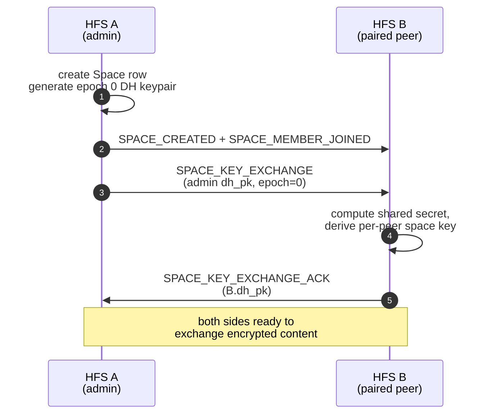
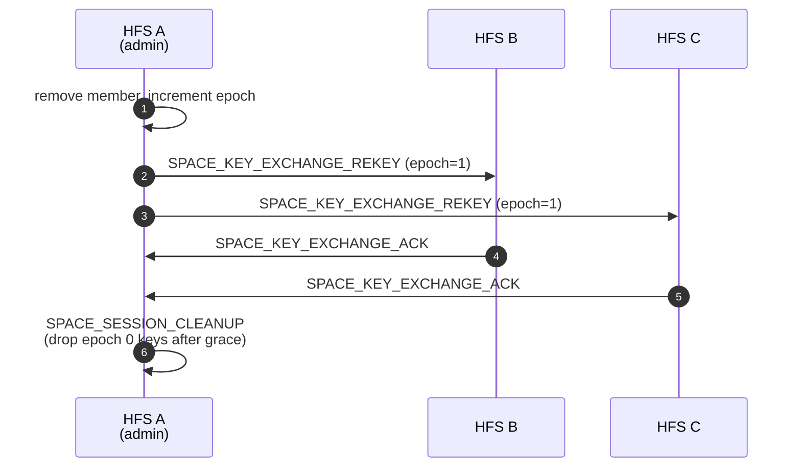
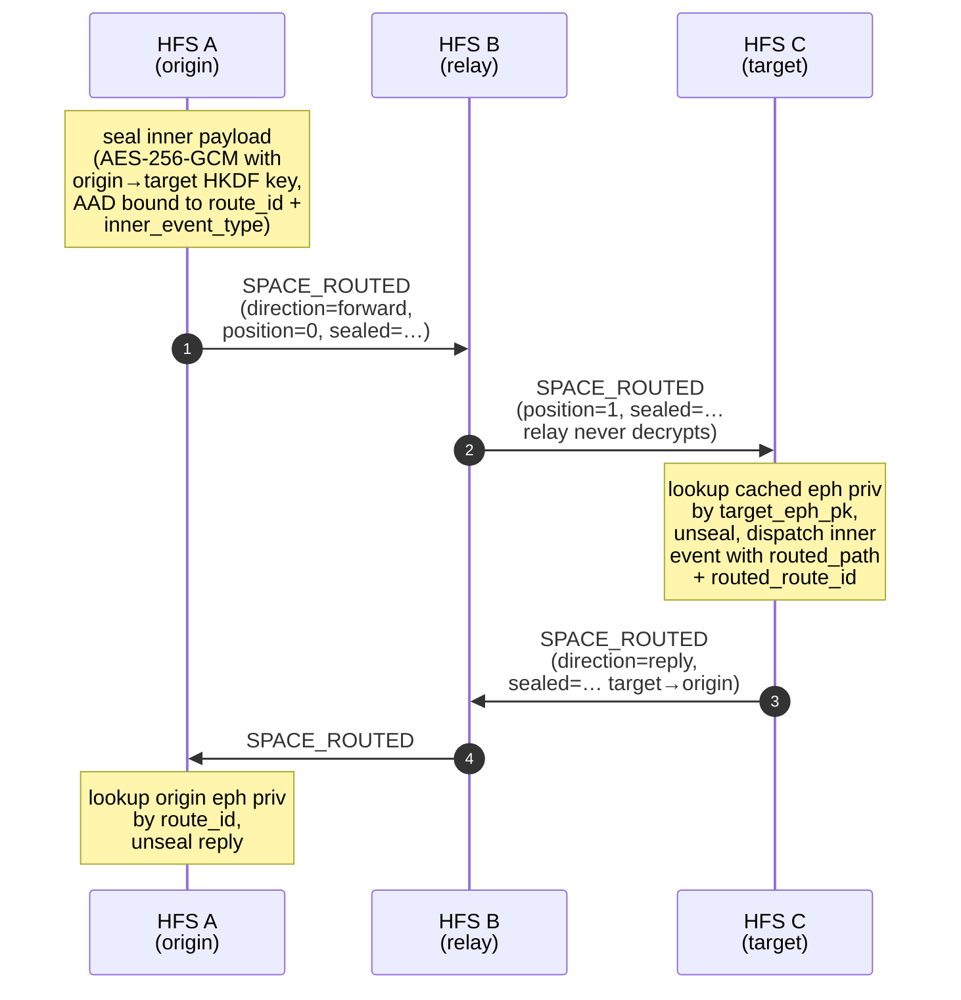

# Spaces

Spaces are the unit of content federation. A space is a group context
— family, neighbourhood, community — with its own membership, its
own encryption epoch, and its own content feed. Each space's membership
may span any number of paired HFS instances.

## Scope

- **HFS**: creates, dissolves, and mutates spaces; broadcasts
  membership and configuration events; runs per-space key exchange.
- **GFS**: only sees public spaces that are explicitly advertised
  (`PUBLIC_SPACE_ADVERTISE`). Private spaces are invisible to GFS.

## Event types

**Lifecycle / membership**

`SPACE_CREATED`, `SPACE_DISSOLVED`, `SPACE_CONFIG_CHANGED`,
`SPACE_MEMBER_JOINED`, `SPACE_MEMBER_LEFT`, `SPACE_MEMBER_BANNED`,
`SPACE_MEMBER_UNBANNED`, `SPACE_INSTANCE_LEFT`, `SPACE_AGE_GATE_UPDATED`.

**Key exchange**

`SPACE_KEY_EXCHANGE`, `SPACE_KEY_EXCHANGE_ACK`,
`SPACE_KEY_EXCHANGE_REKEY`, `SPACE_ADMIN_KEY_SHARE`,
`SPACE_SESSION_CLEANUP`.

**Mesh routing (v_6+)**

`SPACE_ROUTED`, `SPACE_FIND_ROUTE`, `SPACE_ROUTE_FOUND`. Generic
source-routed envelope + the discovery probe that finds the path.
See "Mesh routing (SPACE_ROUTED)" below.

## Flow — create + join



## Flow — rekey

Triggered when a member leaves or is banned. The admin generates a new
epoch and re-shares with every remaining member.



## Admin key share

`SPACE_ADMIN_KEY_SHARE` lets two admins hand each other the space's
current key material — used when ownership is transferred or a
co-admin is added so the new admin can decrypt pre-existing content
without a full resync.

## Age gate

`SPACE_AGE_GATE_UPDATED` propagates changes to a space's minimum-age
requirement (§child-protection). Members below the threshold on any
federated HFS are removed; the event carries the new threshold and a
reason code.

## Mesh routing (SPACE_ROUTED)

Two confirmed peers can exchange any federation event directly. When
the origin and target are **not** directly paired but are connected
via a chain of confirmed peers (`a ↔ b ↔ c`), the origin discovers a
path and ships the inner event inside a generic source-routed
envelope. Relays forward the envelope but never see its content —
the inner payload is sealed end-to-end with a per-route ephemeral
X25519+HKDF key that only the target can derive.

### Discovery (one round per session, ~5 min cached)

```mermaid
sequenceDiagram
    autonumber
    participant A as HFS A<br/>(origin)
    participant B as HFS B<br/>(relay)
    participant C as HFS C<br/>(target)
    A->>B: SPACE_FIND_ROUTE<br/>(request_id, target=C,<br/>hops_traversed=[A], max_hops)
    B->>C: SPACE_FIND_ROUTE<br/>(hops_traversed=[A, B])
    Note over C: target generates fresh<br/>X25519 ephemeral,<br/>caches priv (TTL 5 min)
    C->>B: SPACE_ROUTE_FOUND<br/>(request_id, path=[A, B, C],<br/>target_eph_pk)
    B->>A: SPACE_ROUTE_FOUND<br/>(relayed via cached caller)
    Note over A: pick shortest path,<br/>random tie-break;<br/>cache (path, target_eph_pk)
```

`SPACE_FIND_ROUTE` floods over the federation graph bounded by
``max_hops`` (default 3, capped per-relay so a peer can't burn our
budget by inflating it). Each hop dedups on ``request_id``, refuses
to forward back through itself, and gates forwards on
``peer_supports(min_version=6)`` so sub-v_6 peers are invisible to the
mesh. ROUTE_FOUND responses ride back along the cached caller chain
(``request_id → caller_instance_id``, TTL 60 s).

### Forward + reply leg (any inner event)



Forward and reply use **different** symmetric keys (HKDF info
strings ``socialhome/space_routed/origin-to-target`` vs ``…/target-
to-origin``). The AAD additionally binds ``route_id`` and
``inner_event_type``, with an ``|ack`` suffix on the reply leg so a
forward ciphertext can never be replayed as a reply. The KEM suite
is declared on the wire as ``kem_suite`` (currently
``"x25519"``); receivers reject unknown suites — this is the
forward-hook for the Phase-2 ML-KEM-768 hybrid migration documented
in [`crypto.md`](../crypto.md).

The wire shape of ``SPACE_ROUTED.payload``:

```
{
  "route_id":          "<32 hex>",       # unique per origin send
  "path":              ["a", "b", "c"],  # source-route inclusive
  "position":          0,                # next hop is path[position+1]
  "direction":         "forward"|"reply",
  "inner_event_type":  "<FederationEventType.value>",
  "sealed":            {
    "kem_suite":     "x25519",
    "origin_eph_pk": "<32 b64url>",
    "target_eph_pk": "<32 b64url>",
    "nonce":         "<12 b64url>",
    "ciphertext":    "<aead b64url>"
  }
}
```

### What relays can and cannot see

| Field                | Relay sees? | Notes                                          |
|----------------------|-------------|------------------------------------------------|
| `route_id`           | yes         | nonce — opaque outside the routing layer       |
| `path`               | yes         | by construction (relay routes by `position`)   |
| `position`           | yes         | incremented per hop                            |
| `direction`          | yes         | needed for dedup carve-out                     |
| `inner_event_type`   | yes         | drives the AAD; relay never dispatches it      |
| `sealed.kem_suite`   | yes         | algorithm tag                                  |
| `sealed.*_eph_pk`    | yes         | public keys; harmless                          |
| `sealed.nonce`       | yes         |                                                |
| `sealed.ciphertext`  | yes (bytes) | undecipherable without the matching priv half  |
| **inner payload**    | **no**      | only the target can derive the seal key        |

### First consumer: token-redeem (`SPACE_INVITE_TOKEN_REDEEM`)

PR 1 (v_6) added receiver-initiated cross-instance redeem of
`socialhome://invite#…` codes. PR 2 makes the redeem transparently
ride the mesh when the receiver isn't directly paired with the
issuer — see [`invites.md`](./invites.md#flow--token-redeem-via-mesh).
Future event types (space content fanout to non-paired households,
cross-instance reactions) plug in by calling
`SpaceRoutedHandler.send_routed(...)` with their existing payload
shape — no per-event-type `_ROUTED` variants are needed.

## Implementation

- `socialhome/services/space_service.py` — creation, membership
  mutations, permission guards.
- `socialhome/federation/route_discovery.py` —
  `RouteDiscoveryService`: BFS-flooded probe + per-target ephemeral
  caching + 5-min route cache.
- `socialhome/federation/routed_envelope.py` —
  `SpaceRoutedHandler`: forward / unwrap of `SPACE_ROUTED`; origin
  + target ephemeral state machines.
- `socialhome/federation/routed_crypto.py` — directional
  X25519+HKDF+AES-GCM seal/unseal primitives; KEM suite gating.
- `socialhome/federation/sync/space/` — space-level sync machinery
  (shared with [sync.md](./sync.md)).
- `socialhome/services/federation_inbound/space_membership.py` —
  inbound handlers for `SPACE_CREATED`, `SPACE_MEMBER_JOINED`, etc.
- `socialhome/repositories/space_repo.py`,
  `space_remote_member_repo.py` — persistence.
- `socialhome/routes/space_routes.py` — REST endpoints
  (`/api/spaces/*`).

## Spec references

§13 (Federation: Spaces), §25.8.19 (STRUCTURAL_EVENTS retention),
§25.8.20 (per-space key derivation), §D2 (mesh routing).
