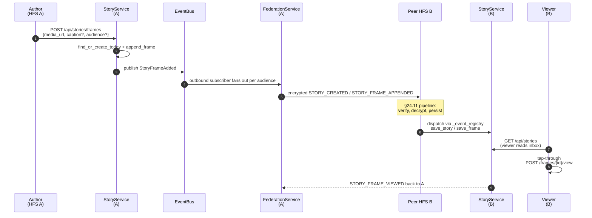

# Stories

Personal "stories" pillar — a WhatsApp/Instagram-style tap-through
sequence of images and short videos, posted to the author's confirmed
peer instances based on an author-controlled audience.

## Scope

- **HFS**: full participant. Authors post frames, peers receive them
  through the §24.11 inbound pipeline.
- **GFS**: uninvolved. Stories are personal-scope, not space-scope.

## Event types

`STORY_CREATED`, `STORY_FRAME_APPENDED`, `STORY_FRAME_DELETED`,
`STORY_DELETED`, `STORY_FRAME_VIEWED`, `STORY_FRAME_REACTED`,
`STORY_FRAME_REACTION_REMOVED`.

Plaintext fields on every envelope: `event_type`, `from_instance`,
`to_instance`, `story_id`, and (where applicable) `frame_id`. Everything
else — `frame_type`, `sequence`, `media_url`, `caption_text`,
`caption_emoji`, `audience_user_ids` (only for `audience_kind=users`),
`expires_at`, viewer / reactor user ids — rides inside the encrypted
payload (§25.8.21).

## Audience kinds

| Kind         | Plaintext addressing                       | Encrypted allow-list |
|--------------|--------------------------------------------|----------------------|
| `all_paired` | one envelope per `confirmed` peer instance | none                 |
| `households` | one envelope per author-picked peer        | none                 |
| `users`      | one envelope per peer hosting any listed   | per-user user-id list — receivers gate before surfacing |

## Day model

`UNIQUE(author_user_id, story_date)` on the `stories` table enforces
"one story per author per day". The first frame of the day creates the
row + emits `STORY_CREATED`; subsequent frames append + emit
`STORY_FRAME_APPENDED`. New day → new story row. The receiving instance
upserts the story by id, then appends the frame.

## Retention

The author's `preferences_json.stories.retention_days` and `.max_count`
configure the local retention policy. The `StoryRetentionScheduler`
runs hourly:

1. Drop rows where `expires_at < now()`.
2. Per author, drop the oldest stories beyond `max_count`.

`feed_posts.linked_story_id` (and the space variant) are `ON DELETE SET
NULL`, so a `story_share` post survives the underlying story's
retention — the share-card renders a "Story has ended" placeholder.

## Mermaid sequence — author posts a frame

## Implementation pointers

- Schema: `socialhome/migrations/0001_initial.sql` — `stories`,
  `story_frames`, `story_frame_views`, `story_frame_reactions`.
- Domain: `socialhome/domain/story.py`.
- Repo: `socialhome/repositories/story_repo.py` (Spec-style audience
  filter on `list_visible_to`).
- Service: `socialhome/services/story_service.py`. `expire_due()`
  drives the scheduler.
- Routes: `socialhome/routes/stories.py`.
- Retention scheduler:
  `socialhome/infrastructure/story_retention_scheduler.py` (copies the
  `_stop: asyncio.Event` template from `replay_cache_scheduler.py`).
- Frontend: `client/src/features/stories/` (3 pages),
  `client/src/components/StoryShareCard.tsx`, and
  `client/src/components/StoryPickerDialog.tsx` for sharing into a feed.

## Spec refs

- §24.11 inbound validation pipeline (encryption-first applies).
- §25.8.21 every field encrypted unless required for routing.
- §Stories (this page) for the author retention + audience model.
