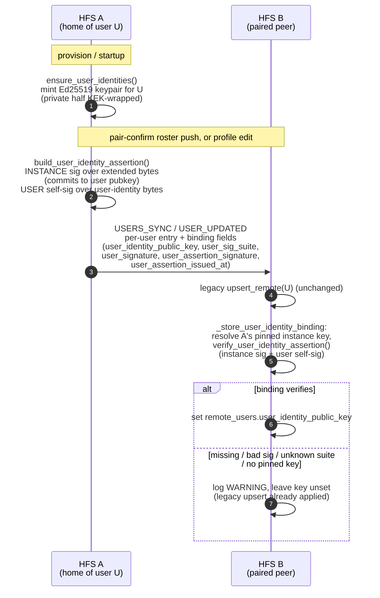

# Independent user identity (Phase 1)

A per-user Ed25519 keypair that gives each household member a portable,
self-verifying identity binding — separate from the household's own
instance key. Phase 1 ships the **binding** only: the legacy `user_id`
stays the canonical address for every user-scoped surface, and nothing
about routing, addressing, or display changes. The binding rides
alongside the existing user fields on `USERS_SYNC` / `USER_UPDATED` so a
receiver *can* attribute federated user activity to a stable per-user
identity, but is not yet required to.

## Scope

- **HFS**: mints an Ed25519 identity keypair for each local user
  (private half KEK-wrapped, never federated). Publishes the public half
  + a dual-signed assertion to v_25-capable peers, and verifies + stores
  a remote user's binding on inbound.
- **GFS**: uninvolved. The binding is exchanged only between paired
  households over the existing peer-to-peer channels.

## Summary — what Phase 1 does and does not do

- **Does:** mint a per-user key, carry it (plus a transplant-resistant
  dual signature) inside the per-user entries of `USERS_SYNC` /
  `USER_UPDATED`, verify it against the envelope sender's pinned instance
  key, and store the remote user's public key on `remote_users`.
- **Does not:** replace `user_id`. The legacy `user_id`
  (`derive_user_id(home_instance_pk, username)`) is unchanged and stays
  the address for every user-scoped event, DM, member reference, and API
  response. The per-user key is a *soft alias* — additive metadata, not a
  new routing key.

The binding is **behaviour-neutral**: a peer that ignores it works
exactly as before. The roadmap (rename to a user-owned identifier, and
move-out of a user from one household to another carrying their key) is
deferred to later phases — Phase 1 is the wire + storage foundation.

## Event types

No new `FederationEventType`. The binding is carried as additional
per-user fields inside the **existing** `USERS_SYNC` (pair-confirm roster
catch-up) and `USER_UPDATED` (profile fan-out) payloads.

## Binding wire fields

Each per-user entry may carry these fields on top of the legacy
(`user_id` / `username` / `display_name` / `bio` / `picture_hash` / …)
shape:

| Field | Content |
|---|---|
| `user_identity_public_key` | hex-encoded 32-byte Ed25519 **user** public key. Presence of this field is what gates binding verification on the receiver. |
| `user_sig_suite` | the user-signature suite — `"ed25519"` in Phase 1 (`USER_SIG_SUITE_ED25519`). |
| `user_signature` | base64url **USER self-signature** over `user_identity_signed_bytes` (proof the user holds their own key). |
| `user_assertion_signature` | base64url **INSTANCE signature** — the home household's signature over the *extended* assertion bytes that commit to the user key. Named distinctly so it can't collide with any per-user `signature` key. |
| `user_assertion_issued_at` | the ISO-8601 UTC `issued_at` the instance signature commits to (drives the ±24 h staleness gate at verify time). |

The five fields together are a **self-verifying portable credential**:
they let a receiver reconstruct and re-verify the whole
`UserIdentityAssertion` *outside* the original signed federation
envelope. Carrying the instance signature + `issued_at` (not just the
user self-sig) is load-bearing — the instance signature is the defence
against the key-transplant attack (see below), and a binding cached or
relayed in a later phase would lose that defence if it shipped the user
self-sig alone.

The binding is gated on `FederationCapability.MIN_FOR_USER_IDENTITY_KEY`
(v_25): it is emitted **only** to a peer that advertises v_25, computed
per-peer because the gate is per-peer. A sub-v_25 peer receives exactly
the legacy per-user shape.

## Dual-signature trust model

Two independent signatures protect a binding; both are verified by
`verify_user_identity_assertion`:

1. **Instance signature** (`user_assertion_signature`) — the home
   household vouches that *this specific user key* belongs to *this
   user*. For a legacy (binding-less) assertion the signed bytes are
   exactly `user_assertion_signed_bytes` (byte-for-byte back-compat with
   pre-v_25 assertions). When a binding is present, those bytes are
   **extended** under a `user-binding` domain separator with the user
   pubkey + suite (`instance_assertion_signed_bytes`), so the instance
   signature *commits to the user key*.

2. **User self-signature** (`user_signature`) — the user proves
   possession of their own key, independent of the hosting instance. It
   covers `user_identity_signed_bytes`: a length-prefixed (`_lv`)
   encoding under the `sh/user-identity/v1` domain tag binding `user_id`,
   `instance_id`, `username`, the user public key, and the suite.

**Why both.** The instance signature alone says "the household vouches
for this key". The user self-signature alone says "someone who holds
this key signed". Only together do they say "the household vouches for
*this* key **and** the key-holder agrees" — and crucially, because the
instance signature is verified against the **envelope sender's pinned
instance key**, the `user_id` and `instance_id` are cryptographically
bound to the household that actually sent the roster. An attacker can't
swap in their own user pubkey and reuse the victim's instance signature
(the signature now commits to the key), nor forge the household's
vouching (they don't hold the instance seed).

Verification, in order (`verify_user_identity_assertion`):

- `instance_id` matches `derive_instance_id(sender_instance_pk)`;
- `user_id` matches `derive_user_id(sender_instance_pk, identity_anchor)`
  when the binding carries an `identity_anchor`, else
  `derive_user_id(sender_instance_pk, username)` for a legacy / sub-v_26
  binding (see *Identity anchor* below);
- the suite is in `SUPPORTED_USER_SIG_SUITES` (a present-but-unknown
  suite raises `UnsupportedUserSigSuite` — **no default fallback**); a
  first-revision payload that omits `user_sig_suite` defaults to
  `ed25519` (the documented migration tripwire);
- the **instance** signature verifies over the extended bytes;
- the **user** self-signature verifies against `user_identity_public_key`;
- `issued_at` is within ±24 h (not expired, not future-dated).

## Identity anchor (v_26)

Phase 2 anchors the `user_id` derivation to an immutable per-user
`identity_anchor` instead of the (mutable) human username:

    user_id = derive_user_id(instance_pk, identity_anchor)

- **New standalone users** get a uuid4 `identity_anchor` (`uuid.uuid4().hex`)
  minted **once** at provision and **frozen** thereafter — a later rename
  leaves `user_id` stable. The anchor is set at the provision site in
  `socialhome/services/user_service.py` and must never be mutated.
- **Existing users** (migrated) and **haos** users have
  `identity_anchor == username`, so their `user_id` is byte-for-byte the
  legacy `derive_user_id(instance_pk, username)` — no churn for any account
  that predates v_26.

The binding carries the anchor on the wire as the `identity_anchor` field,
and it is committed to by **both** signatures: the **instance** signature
(via the extended `instance_assertion_signed_bytes` tail) and the **user**
self-signature (via `user_identity_signed_bytes`). A receiver therefore
re-derives `user_id` from the signed anchor — an attacker can neither swap
the anchor nor reuse the signature against a different one.

`verify_user_identity_assertion` derives the expected `user_id` from
`assertion.identity_anchor` when present, else falls back to
`assertion.username`. A **first-revision / sub-v_26 binding omits the field**
(`identity_anchor is None`) and verifies exactly as before against the
username — the documented migration tripwire.

The `identity_anchor` field is gated on
`FederationCapability.MIN_FOR_IDENTITY_ANCHOR` (v_26): emitted **only** to a
peer advertising v_26, computed per-peer.

**Migration tail.** A user provisioned **before** v_26 has
`identity_anchor == username`, so their `user_id` is identical everywhere
and their binding verifies on peers of **any** version. A **uuid-anchored**
user created **after** v_26 has a `user_id` that no longer equals
`derive_user_id(pk, username)`; their binding only verifies on a **v_26+
peer** that receives and re-derives from the `identity_anchor`. The sender
gates the anchor field on `MIN_FOR_IDENTITY_ANCHOR`, so a sub-v_26 peer
receives the Phase-1 (anchor-free) binding whose signed bytes commit to no
anchor; that peer derives `user_id` from the username, which for a
uuid-anchored user **won't match** the asserted `user_id`, so the binding is
rejected **fail-soft** (legacy user row still mirrors via `upsert_remote` —
only the per-user identity key is unavailable until the older peer
upgrades). Existing username-anchored users are unaffected on every peer.

## Flow

## Fail-soft behaviour

The binding never breaks the surrounding user sync. On the **outbound**
side, any error fetching the keypair — or a user whose key the startup
backfill hasn't minted yet, or a service wired without a `user_repo` —
degrades to the legacy per-user shape rather than dropping the user from
the snapshot. On the **inbound** side, `_store_user_identity_binding` is
a no-op when the binding fields are absent, and any verification failure
(bad signature, unknown suite, `instance_id` mismatch, no pinned sender
key) logs a WARNING and leaves the key unset — it never raises, never
drops the surrounding sync, and never stores an unverified key. The
legacy `upsert_remote` has already run, so the user is mirrored either
way.

## Known limitation (Phase 1) — replay / rotation

Storing a verified binding is an **unconditional UPDATE** of
`remote_users.user_identity_public_key`. The assertion's ±24 h
`issued_at` staleness gate bounds replay, but there is no per-user
monotonic freshness check, so a captured ≤24 h-old valid binding could
replay over a *rotated* key — and only ever back to a prior **legitimate**
key (attacker-key injection is blocked by the sender-pinned-key
verification). This is **inert in Phase 1** because user-key rotation
does not exist yet. Phase 3/4 (bindings cached + relayed standalone)
MUST add a stored-`issued_at` monotonic guard before the UPDATE. See the
comment at the store site in
`federation_inbound_service.py:_store_user_identity_binding`.

## Implementation

- `socialhome/crypto.py` — `USER_SIG_SUITE_ED25519` /
  `SUPPORTED_USER_SIG_SUITES` / `UnsupportedUserSigSuite` /
  `validate_user_sig_suite`; `user_identity_signed_bytes` (user self-sig
  bytes, `sh/user-identity/v1` domain tag); `sign_user_self` /
  `verify_user_self`; `instance_assertion_signed_bytes` (legacy bytes,
  extended with the `user-binding` tail when a binding is present);
  `build_user_identity_assertion`; `verify_user_identity_assertion`.
- `socialhome/domain/user.py` — `UserIdentityAssertion`'s
  `user_identity_public_key` / `user_pq_public_key` / `user_sig_suite` /
  `user_signature` fields (all `None`-default for back-compat).
- `socialhome/infrastructure/user_identity.py` —
  `ensure_user_identities` (lazy backfill; mints the classical half, PQ
  half deferred to the PQ-suite rollout). Called at provision and
  startup.
- `socialhome/services/user_identity_binding.py` —
  `user_identity_binding_fields`: the single place the v_25 gate, key
  fetch, suite, and assertion build live for both outbound services.
- `socialhome/services/users_sync_outbound.py` /
  `socialhome/services/profile_federation_outbound.py` — per-peer call
  sites that merge the binding fields into the per-user entries.
- `socialhome/services/federation_inbound_service.py` —
  `_store_user_identity_binding`: verifies against the sender's pinned
  instance key and stores `remote_users.user_identity_public_key`.
- `socialhome/repositories/user_repo.py` —
  `get_user_identity_keypair` (KEK-unwrap for signing) /
  `set_remote_user_identity_key` (store verified remote pubkey).
- Migration `0040_user_identity_keys.sql` — the new `users` /
  `remote_users` columns.
- Migration `0041_user_identity_anchor.sql` — the `users.identity_anchor`
  column (uuid for new users, backfilled to `= username` for existing rows;
  `remote_users.identity_anchor` mirrors a verified remote anchor).
- `socialhome/services/user_service.py` — mints the immutable uuid4
  `identity_anchor` once at provision and derives `user_id` from it.
- `socialhome/crypto.py` — `derive_user_id` / `user_identity_signed_bytes`
  / `instance_assertion_signed_bytes` / `verify_user_identity_assertion`
  all take the optional `identity_anchor` (committed into both signatures;
  drives the `user_id`-derivation check, falling back to `username`).
- `socialhome/domain/federation_capabilities.py` —
  `FederationCapability.MIN_FOR_USER_IDENTITY_KEY` (v_25) and
  `MIN_FOR_IDENTITY_ANCHOR` (v_26).

## Spec references

§4.1 (identity model), §4.1.4 (`UserIdentityAssertion`),
§25.8 (post-quantum migration — the Phase-2 hybrid `ed25519+mldsa65`
user suite). Capability history: [`capabilities.md`](./capabilities.md)
v_25 (per-user binding) and v_26 (uuid identity anchor).
